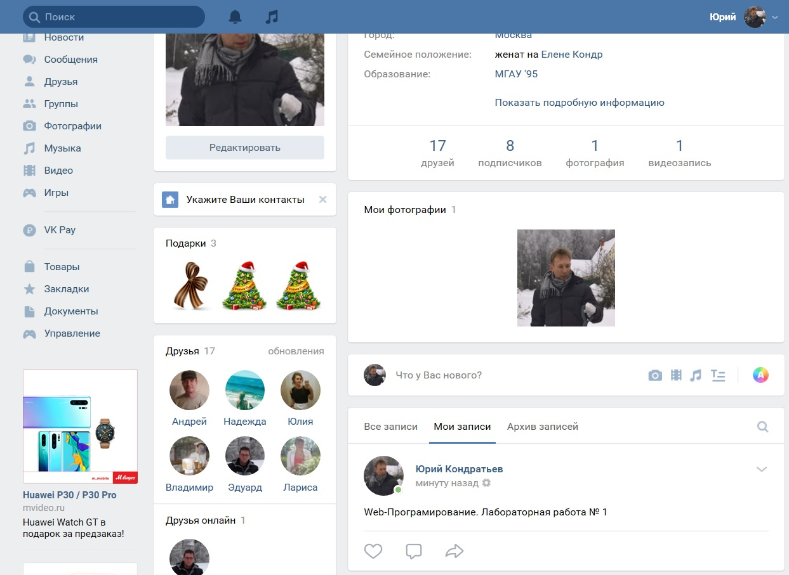

                МОСКОВСКИЙ ГОСУДАРСТВЕННЫЙ ТЕХНИЧЕСКИЙ 
                        УНИВЕРСИТЕТ имени Н.Э.Баумана


                        Отчет по лабораторной работе № 1
                            по курсу «Web-Технологии»

                        «Изучение протокола HTTP»


                                                    Выполнил: студент группы ИУ7-78Б(В)  
                                                    Кондратьев Ю.А.
                                                    Проверил: преподаватель кафедры ИУ7
                                                    Бекасов Д.Е.


                                Москва, 2019
---------------------------------------------------------------------------------

**Цель работы:** Цель данной работы – ознакомится с применением протокола HTTP на практике, в реальных системах. Каждый из рассмотренных типов запросов предлагается отправить на несколько известных интернет-сервисов. Впрочем, сервисы указаны лишь как примеры и при желании вы можете выбрать другие (социальные сети, почта, облака, новостные сайты и т.д.).  

**Ход выполнения работы:**  
1. С помощью специального ПО (Postman, либо многочисленные аналоги, например, Restlet Clent - расширение для Chrome) вручную отправить следующие запросы и ответить на предлагаемые вопросы. 
2. Работа с api сайта. Многие крупные сервисы предоставляют открытое api. Как правило, оно реализовано на подходе REST, но это необязательно. Такое api используется сторонними сервисами и приложениями, которые хотят воспользоваться услугами предоставляющего такое api сервиса. Рассмотрим такое api на примере сайта vk.com (при желании можно выбрать другой подходящий сервис).
3. .       Реализуйте небольшое серверное приложение, с использованием любого фреймворка. Лучшего всего для этой цели подойдет NodeJS: решение получится очень компактным и простым.
  Сервер должен содержать предоставлять API с поддержкой (GET, POST, DELETE, PUT, OPTION). Данные отправлять в формате json. Конкретное содержание запросов - на ваше усмотрение. Подключите фантазию. (Можно сделать простейший CRUD-сервис с хранением данных в RAM).

***1. Вручную отправить следующие запросы и ответить на предлагаемые вопросы.***

   
**Запрос OPTIONS** Отправлены на адреса http://mail.ru, http://ya.ru, www.rambler.ru, https://www.google.ru, https://github.com/,   www.apple.com/.

Запрос OPTIONS используется для определения возможностей веб-сервера или параметров соединения для конкретного ресурса. В ответ серверу следует включить заголовок Allow со списком поддерживаемых методов. Также в заголовке ответа может включаться информация о поддерживаемых расширениях.

*Результаты отправки запросов:*     
http://mail.ru 

*запрос:*
OPTIONS  HTTP/1.1  
Host: www.mail.ru  
cache-control: no-cache  
Postman-Token: 8445f518-0f98-4a1d-823c-ef38338d8b92

*ответ:*  Status:200 (Хорошо)
Headers:  
Server →nginx/1.14.1
Date →Thu, 04 Apr 2019 14:10:12 GMT
Content-Type →text/html; charset=utf-8
Transfer-Encoding →chunked
Connection →keep-alive
Set-Cookie →act=77d6a3fb4f32466fb75da940ac909da1; path=/; domain=.mail.ru; Secure; HttpOnly
Set-Cookie →mrcu=EB735CA6104410CA1653256F45D4; expires=Sun, 01 Apr 2029 14:10:12 GMT; path=/; domain=.mail.ru; HttpOnly
Cache-Control →no-cache,no-store,must-revalidate
Pragma →no-cache
Expires →Wed, 04 Apr 2018 14:10:12 GMT
Last-Modified →Thu, 04 Apr 2019 17:10:12 GMT
Content-Security-Policy →default-src mail.ru *.mail.ru *.imgsmail.ru *.mradx.net *.serving-sys.com *.moatads.com *.doubleverify.com *.adsafeprotected.com; script-src 'unsafe-inline' 'unsafe-eval' mail.ru *.mail.ru *.imgsmail.ru *.mradx.net *.odnoklassniki.ru ok.ru *.doubleverify.com *.dvtps.com *.doubleclick.net *.googletagservices.com *.googlesyndication.com *.googleadservices.com *.moatads.com *.adlooxtracking.com *.adsafeprotected.com *.serving-sys.com; img-src data: blob: *; style-src 'unsafe-inline' 'unsafe-eval' blob: *.mail.ru *.imgsmail.ru *.mradx.net; font-src data: blob: https: *.mail.ru *.imgsmail.ru *.mradx.net; frame-src mail.ru *.mail.ru *.mradx.net *.doubleverify.com *.doubleclick.net ok.ru *.ok.ru; child-src mail.ru *.mail.ru *.mradx.net *.doubleverify.com *.doubleclick.net ok.ru *.ok.ru; report-uri https://cspreport.mail.ru/splash;
X-Frame-Options →SAMEORIGIN
X-XSS-Protection →1; mode=block; report=https://cspreport.mail.ru/xxssprotection
X-Content-Type-Options →nosniff
Strict-Transport-Security →max-age=16070400
Content-Encoding →gzip

http://ya.ru


*запрос:*
OPTIONS  HTTP/1.1
Host: ya.ru
cache-control: no-cache
Postman-Token: ce6d18da-c1b1-428e-a722-765c50cf940d

*ответ:*  
Header:  
Status:403 ForBidden («запрещено, не уполномочен)
Date →Thu, 04 Apr 2019 14:20:30 GMT
Content-Type →text/html; charset=utf-8
ETag →W/"5ca4d2a2-3077"
Content-Encoding →gzip
X-Content-Type-Options →nosniff
Transfer-Encoding →chunked

www.rambler.ru


*запрос:*


*ответ:*  Status:000 ###### («запрещено, не уполномочен)

------------------------------------------------------------------
http://ya.ru


*запрос:*
OPTIONS  HTTP/1.1
Host: www.rambler.ru
cache-control: no-cache
Postman-Token: 57437914-a4f1-48be-a038-0a0380c9d4b5


*ответ:*  Status:403 ForBidden («запрещено, не уполномочен)  
Header:  
Server →nginx
Date →Thu, 04 Apr 2019 14:25:09 GMT
Content-Type →text/html; charset=utf-8
Transfer-Encoding →chunked
Connection →keep-alive
Keep-Alive →timeout=50
Last-Modified →Wed, 30 Jan 2019 09:20:08 GMT
Vary →Accept-Encoding
ETag →W/"5c516c48-2aeb"
Content-Encoding →gzip
X-Cache →REVALIDATED
Set-Cookie →ruid=vAsAAMUTplwKVP5FAaqCAQB=; expires=Thu, 31-Dec-37 23:55:55 GMT; domain=.rambler.ru; path=/
P3P →CP="NON DSP NID ADMa DEVa TAIa PSAa PSDa OUR IND UNI COM NAV"  

*Body:*  

&lt;!DOCTYPE html>  
&lt;html class="no-js" lang="">
    &lt;head>  
        &lt;meta charset="utf-8">  
        &lt;meta http-equiv="x-ua-compatible" content="ie=edge">  
        &lt;title>403 error&lt;/title>  
        &lt;meta name="description" content="">  
        &lt;meta name="viewport" content="width=device-width, initial-scale=1">  
        &lt;link rel="apple-touch-icon" sizes="57x57" href="/errorpage_assets/favicon/apple-touch-icon-57x57.png" />  
        &lt;link rel="apple-touch-icon" sizes="60x60" href="/errorpage_assets/favicon/apple-touch-icon-60x60.png" />  
        &lt;link rel="apple-touch-icon" sizes="72x72" href="/errorpage_assets/favicon/apple-touch-icon-72x72.png" />  
        &lt;link rel="apple-touch-icon" sizes="76x76" href="/errorpage_assets/favicon/apple-touch-icon-76x76.png" />  
        &lt;link rel="apple-touch-icon" sizes="114x114" href="/errorpage_assets/favicon/apple-touch-icon-114x114.png" />  
        &lt;link rel="apple-touch-icon" sizes="120x120" href="/errorpage_assets/favicon/apple-touch-icon-120x120.png" />  
        &lt;link rel="apple-touch-icon" sizes="144x144" href="/errorpage_assets/favicon/apple-touch-icon-144x144.png" />  
        &lt;link rel="apple-touch-icon" sizes="152x152" href="/errorpage_assets/favicon/apple-touch-icon-152x152.png" />  
        &lt;link rel="apple-touch-icon" sizes="180x180" href="/errorpage_assets/favicon/apple-touch-icon-180x180.png" />  
        &lt;link rel="icon" type="image/png" href="/errorpage_assets/favicon/favicon-32x32.png" sizes="32x32" />  
        &lt;link rel="icon" type="image/png" href="/errorpage_assets/favicon/android-chrome-192x192.png" sizes="192x192" />  
        &lt;link rel="icon" type="image/png" href="/errorpage_assets/favicon/favicon-96x96.png" sizes="96x96" />  
        &lt;link rel="icon" type="image/png" href="/errorpage_assets/favicon/favicon-16x16.png" sizes="16x16" />  
        &lt;link rel="manifest" href="/errorpage_assets/favicon/manifest.json" />  
        &lt;link rel="mask-icon" href="/errorpage_assets/favicon/safari-pinned-tab.svg" color="#315efb" />  
        &lt;link rel="manifest" href="site.webmanifest">  
        &lt;link rel="apple-touch-icon" href="icon.png">  
        &lt;link rel="stylesheet" href="/errorpage_assets/main.css?v1.1.0">  
    &lt;/head>  
    &lt;body>  
        &lt;script src="//st.top100.ru/top100/top100.js" async>&lt;/script>  
        &lt;script src="/errorpage_assets/main.js?v1.1.0">&lt;/script>  
        &lt;!-- [if IE]   
        &lt;!-->  
        &lt;script>  
      !function(e,t){var n=t.createElement("script"),r=t.scripts,i=r[r.length-1];n.src=e,n.id="rambler-topline-injector",i.parentNode.insertBefore(n,i.nextSibling)}
      ("//topline.rambler.ru/new/latest/bundle.js",document);
    &lt;/script>  
        &lt;!--if IE
    | >[endif]
        -->  
        &lt;script type="text/javascript" src="//ssp.rambler.ru/capirs.js">&lt;/script>  
        &lt;div class="wrapper">  
            &lt;div class="error-body">  
                &lt;div class="error-inner">  
                    &lt;div class="icon" style="background-image: url(/errorpage_assets/images/403.svg);">&lt;/div>
                    &lt;div class="inner">  
                        &lt;h1 class="error-title">Доступ запрещен&lt;/h1>
                        &lt;div class="error-text">  
                            &lt;p>Поздравляем, вы нашли тайную дверь.&lt;/p>  
                            &lt;p>Но дальше вы пройти не сможете.&lt;/p>   
                            &lt;p>Попробуйте начать заново с главной&nbsp;
                                &lt;a href="https://rambler.ru">Рамблера&lt;/a>'   


https://www.google.ru

*запрос:*
OPTIONS  HTTP/1.1
Host: www.google.ru
cache-control: no-cache
Postman-Token: 512d0f3e-b9a2-46c1-a666-21118f61300f

*ответ* Status:405 Method Not Allowed («запрещено, не уполномочен)  
Header:   
Allow →GET, HEAD
Date →Fri, 05 Apr 2019 08:36:19 GMT
Content-Type →text/html; charset=UTF-8
Server →gws
Content-Length →1592
X-XSS-Protection →0
X-Frame-Options →SAMEORIGIN
Alt-Svc →quic=":443"; ma=2592000; v="46,44,43,39"


*body:* 
 
&lt;!DOCTYPE html>
&lt;html lang=en>  
    &lt;meta charset=utf-8>  
    &lt;meta name=viewport content="initial-scale=1, minimum-scale=1, width=device-width">  
    &lt;title>Error 405 (Method Not Allowed)!!1&lt;/title>
    &lt;style>  
    *{margin:0;padding:0}html,code{font:15px/22px arial,sans-serif}html{background:#fff;color:#222;padding:15px}body{margin:7% auto 0;max-width:390px;min-height:180px;padding:30px 0 15px}* > body{background:url(//www.google.com/images/errors/robot.png) 100% 5px no-repeat;padding-right:205px}p{margin:11px 0 22px;overflow:hidden}ins{color:#777;text-decoration:none}a img{border:0}@media screen and (max-width:772px){body{background:none;margin-top:0;max-width:none;padding-right:0}}#logo{background:url(//www.google.com/images/branding/googlelogo/1x/googlelogo_color_150x54dp.png) no-repeat;margin-left:-5px}@media only screen and (min-resolution:192dpi){#logo{background:url(//www.google.com/images/branding/googlelogo/2x/googlelogo_color_150x54dp.png) no-repeat 0% 0%/100% 100%;-moz-border-image:url(//www.google.com/images/branding/googlelogo/2x/googlelogo_color_150x54dp.png) 0}}@media only screen and (-webkit-min-device-pixel-ratio:2){#logo{background:url(//www.google.com/images/branding/googlelogo/2x/googlelogo_color_150x54dp.png) no-repeat;-webkit-background-size:100% 100%}}#logo{display:inline-block;height:54px;width:150px}
  &lt;/style>  
    &lt;a href=//www.google.com/>  
    &lt;span id=logo aria-label=Google>&lt;/span>  
&lt;/a>  
&lt;p>  
    &lt;b>405.&lt;/b>  
    &lt;ins>That’s an error.&lt;/ins>  
    &lt;p>The request method 
        &lt;code>OPTIONS&lt;/code> is inappropriate for the URL
        &lt;code>/&lt;/code>.  
        &lt;ins>That’s all we know.&lt;/ins>  

**https://github.com**  
*запрос:*  
OPTIONS  HTTP/1.1  
Host: github.com  
cache-control: no-cache  
Postman-Token: a98ffe14-7649-412a-be7d-81faf912cdfa  

*ответ* Status:404 Not Found ("Не найдено")  
Header:   
Date →Fri, 05 Apr 2019 08:49:29 GMT
Content-Type →text/html; charset=utf-8
Content-Length →0
Server →GitHub.com
Status →404 Not Found
X-Request-Id →d4b5d3c1-2817-441c-a6a4-0ffe7d0061b8
Strict-Transport-Security →max-age=31536000; includeSubdomains; preload
X-Frame-Options →deny
X-Content-Type-Options →nosniff
X-XSS-Protection →1; mode=block
Referrer-Policy →origin-when-cross-origin, strict-origin-when-cross-origin
Expect-CT →max-age=2592000, report-uri="https://api.github.com/_private/browser/errors"
Content-Security-Policy →default-src 'none'; base-uri 'self'; block-all-mixed-content; connect-src 'self' uploads.github.com www.githubstatus.com collector.githubapp.com api.github.com www.google-analytics.com github-cloud.s3.amazonaws.com github-production-repository-file-5c1aeb.s3.amazonaws.com github-production-upload-manifest-file-7fdce7.s3.amazonaws.com github-production-user-asset-6210df.s3.amazonaws.com; font-src github.githubassets.com; form-action 'self' github.com gist.github.com; frame-ancestors 'none'; frame-src render.githubusercontent.com; img-src 'self' data: github.githubassets.com media.githubusercontent.com camo.githubusercontent.com identicons.github.com collector.githubapp.com avatars0.githubusercontent.com avatars1.githubusercontent.com avatars2.githubusercontent.com avatars3.githubusercontent.com github-cloud.s3.amazonaws.com; manifest-src 'self'; media-src 'none'; script-src github.githubassets.com; style-src 'unsafe-inline' github.githubassets.com
X-GitHub-Request-Id →B66B:9EC7:DAF00B:14E1D77:5CA71698

*body:*  
Нет. 

 **www.apple.com**  
 *запрос:*  
OPTIONS  HTTP/1.1
Host: www.apple.com
cache-control: no-cache
Postman-Token: 4ffd2174-f135-4d61-b3cd-2f341992e7b8

*ответ* Status:404 Not Found ("Не найдено")  
Header: 
Server →Apache
Content-Type →text/html; charset=UTF-8
X-Frame-Options →SAMEORIGIN
Vary →Accept-Encoding
X-Content-Type-Options →nosniff
X-Xss-Protection →1; mode=block
Content-Encoding →gzip
Cache-Control →max-age=0
Expires →Fri, 05 Apr 2019 08:57:51 GMT
Date →Fri, 05 Apr 2019 08:57:51 GMT
Content-Length →8118
Connection →keep-alive  

*body:*   
&lt;!DOCTYPE html>  
&lt;html xmlns="http://www.w3.org/1999/xhtml" xml:lang="en-US" lang="en-US" prefix="og: http://ogp.me/ns#" class="no-js" data-layout-name="at-work">  
    &lt;head>  
        &lt;meta charset="utf-8" />  
        &lt;link rel="canonical" href="https://www.apple.com/" />  
        &lt;link rel="alternate" href="https://www.apple.com/" hreflang="en-US" />  
        &lt;link rel="alternate" href="https://www.apple.com/ae-ar/" hreflang="ar-AE" />  
        &lt;link rel="alternate" href="https://www.apple.com/ae/" hreflang="en-AE" />
        &lt;link rel="alternate" href="https://www.apple.com/am/" hreflang="en-AM" />
        &lt;link rel="alternate" href="https://www.apple.com/at/" hreflang="de-AT" />
        &lt;link rel="alternate" href="https://www.apple.com/au/" hreflang="en-AU" />
        &lt;link rel="alternate" href="https://www.apple.com/befr/" hreflang="fr-BE" />
        &lt;link rel="alternate" href="https://www.apple.com/benl/" hreflang="nl-BE" />
        &lt;link rel="alternate" href="https://www.apple.com/bg/" hreflang="bg-BG" />
        &lt;link rel="alternate" href="https://www.apple.com/bh-ar/" hreflang="ar-BH" />
        &lt;link rel="alternate" href="https://www.apple.com/bh/" hreflang="en-BH" />
        &lt;link rel="alternate" href="https://www.apple.com/br/" hreflang="pt-BR" />
        &lt;link rel="alternate" href="https://www.apple.com/bw/" hreflang="en-BW" />
        &lt;link rel="alternate" href="https://www.apple.com/ca/" hreflang="en-CA" />
        &lt;link rel="alternate" href="https://www.apple.com/ca/fr/" hreflang="fr-CA" />
        &lt;link rel="alternate" href="https://www.apple.com/cf/" hreflang="fr-CF" />
        &lt;link rel="alternate" href="https://www.apple.com/chde/" hreflang="de-CH" />
        &lt;link rel="alternate" href="https://www.apple.com/chfr/" hreflang="fr-CH" />
        &lt;link rel="alternate" href="https://www.apple.com/ci/" hreflang="fr-CI" />
        &lt;link rel="alternate" href="https://www.apple.com/cl/" hreflang="es-CL" />
        &lt;link rel="alternate" href="https://www.apple.com/cm/" hreflang="fr-CM" />
        &lt;link rel="alternate" href="https://www.apple.com/cn/" hreflang="zh-CN" />
        &lt;link rel="alternate" href="https://www.apple.com/co/" hreflang="es-CO" />
        &lt;link rel="alternate" href="https://www.apple.com/cz/" hreflang="cs-CZ" />
        &lt;link rel="alternate" href="https://www.apple.com/de/" hreflang="de-DE" />
        &lt;link rel="alternate" href="https://www.apple.com/dk/" hreflang="da-DK" />
        &lt;link rel="alternate" href="https://www.apple.com/ee/" hreflang="et-EE" />
        &lt;link rel="alternate" href="https://www.apple.com/eg-ar/" hreflang="ar-EG" />
        &lt;link rel="alternate" href="https://www.apple.com/eg/" hreflang="en-EG" />
        &lt;link rel="alternate" href="https://www.apple.com/es/" hreflang="es-ES" />
        &lt;link rel="alternate" href="https://www.apple.com/fi/" hreflang="fi-FI" />
        &lt;link rel="alternate" href="https://www.apple.com/fr/" hreflang="fr-FR" />
        &lt;link rel="alternate" href="https://www.apple.com/gn/" hreflang="fr-GN" />
        &lt;link rel="alternate" href="https://www.apple.com/gq/" hreflang="fr-GQ" />
        &lt;link rel="alternate" href="https://www.apple.com/gr/" hreflang="el-GR" />
        &lt;link rel="alternate" href="https://www.apple.com/gw/" hreflang="en-GW" />
        &lt;link rel="alternate" href="https://www.apple.com/hk/" hreflang="zh-HK" />
        &lt;link rel="alternate" href="https://www.apple.com/hk/en/" hreflang="en-HK" />
        &lt;link rel="alternate" href="https://www.apple.com/hr/" hreflang="hr-HR" />
        &lt;link rel="alternate" href="https://www.apple.com/hu/" hreflang="hu-HU" />
        &lt;link rel="alternate" href="https://www.apple.com/id/" hreflang="id-ID" />
        &lt;link rel="alternate" href="https://www.apple.com/ie/" hreflang="en-IE" />
        &lt;link rel="alternate" href="https://www.apple.com/il/" hreflang="en-IL" />
        &lt;link rel="alternate" href="https://www.apple.com/in/" hreflang="en-IN" />
        &lt;link rel="alternate" href="https://www.apple.com/it/" hreflang="it-IT" />
        &lt;link rel="alternate" href="https://www.apple.com/jo-ar/" hreflang="ar-JO" />
        &lt;link rel="alternate" href="https://www.apple.com/jo/" hreflang="en-JO" />
        &lt;link rel="alternate" href="https://www.apple.com/jp/" hreflang="ja-JP" />
        &lt;link rel="alternate" href="https://www.apple.com/ke/" hreflang="en-KE" />
        &lt;link rel="alternate" href="https://www.apple.com/kr/" hreflang="ko-KR" />
        &lt;link rel="alternate" href="https://www.apple.com/kw-ar/" hreflang="ar-KW" />
        &lt;link rel="alternate" href="https://www.apple.com/kw/" hreflang="en-KW" />
        &lt;link rel="alternate" href="https://www.apple.com/la/" hreflang="es-419" />
        &lt;link rel="alternate" href="https://www.apple.com/lae/" hreflang="en-419" />
        &lt;link rel="alternate" href="https://www.apple.com/li/" hreflang="de-LI" />
        &lt;link rel="alternate" href="https://www.apple.com/lt/" hreflang="lt-LT" />
        &lt;link rel="alternate" href="https://www.apple.com/lu/" hreflang="fr-LU" />
        &lt;link rel="alternate" href="https://www.apple.com/lv/" hreflang="lv-LV" />
        &lt;link rel="alternate" href="https://www.apple.com/ma/" hreflang="fr-MA" />
        &lt;link rel="alternate" href="https://www.apple.com/md/" hreflang="en-MD" />
        &lt;link rel="alternate" href="https://www.apple.com/me/" hreflang="en-ME" />
        &lt;link rel="alternate" href="https://www.apple.com/mg/" hreflang="fr-MG" />
        &lt;link rel="alternate" href="https://www.apple.com/mk/" hreflang="en-MK" />
        &lt;link rel="alternate" href="https://www.apple.com/ml/" hreflang="fr-ML" />
        &lt;link rel="alternate" href="https://www.apple.com/mo/" hreflang="zh-MO" />
        &lt;link rel="alternate" href="https://www.apple.com/mt/" hreflang="en-MT" />
        &lt;link rel="alternate" href="https://www.apple.com/mu/" hreflang="fr-MU" />
        &lt;link rel="alternate" href="https://www.apple.com/mx/" hreflang="es-MX" />
        &lt;link rel="alternate" href="https://www.apple.com/my/" hreflang="en-MY" />
        &lt;link rel="alternate" href="https://www.apple.com/mz/" hreflang="en-MZ" />
        &lt;link rel="alternate" href="https://www.apple.com/ne/" hreflang="fr-NE" />
        &lt;link rel="alternate" href="https://www.apple.com/ng/" hreflang="en-NG" />
        &lt;link rel="alternate" href="https://www.apple.com/nl/" hreflang="nl-NL" />
        &lt;link rel="alternate" href="https://www.apple.com/no/" hreflang="no-NO" />
        &lt;link rel="alternate" href="https://www.apple.com/nz/" hreflang="en-NZ" />
        &lt;link rel="alternate" href="https://www.apple.com/om-ar/" hreflang="ar-OM" />
        &lt;link rel="alternate" href="https://www.apple.com/om/" hreflang="en-OM" />
        &lt;link rel="alternate" href="https://www.apple.com/ph/" hreflang="en-PH" />
        &lt;link rel="alternate" href="https://www.apple.com/pl/" hreflang="pl-PL" />
        &lt;link rel="alternate" href="https://www.apple.com/pt/" hreflang="pt-PT" />
        &lt;link rel="alternate" href="https://www.apple.com/qa-ar/" hreflang="ar-QA" />
        &lt;link rel="alternate" href="https://www.apple.com/qa/" hreflang="en-QA" />
        &lt;link rel="alternate" href="https://www.apple.com/ro/" hreflang="ro-RO" />
        &lt;link rel="alternate" href="https://www.apple.com/ru/" hreflang="ru-RU" />
        &lt;link rel="alternate" href="https://www.apple.com/sa-ar/" hreflang="ar-SA" />
        &lt;link rel="alternate" href="https://www.apple.com/sa/" hreflang="en-SA" />
        &lt;link rel="alternate" href="https://www.apple.com/se/" hreflang="sv-SE" />
        &lt;link rel="alternate" href="https://www.apple.com/sg/" hreflang="en-SG" />
        &lt;link rel="alternate" href="https://www.apple.com/si/" hreflang="en-SI" />
        &lt;link rel="alternate" href="https://www.apple.com/sk/" hreflang="sk-SK" />
        &lt;link rel="alternate" href="https://www.apple.com/sn/" hreflang="fr-SN" />
        &lt;link rel="alternate" href="https://www.apple.com/th/" hreflang="th-TH" />
        &lt;link rel="alternate" href="https://www.apple.com/tn/" hreflang="fr-TN" />
        &lt;link rel="alternate" href="https://www.apple.com/tr/" hreflang="tr-TR" />
        &lt;link rel="alternate" href="https://www.apple.com/tw/" hreflang="zh-TW" />
        &lt;link rel="alternate" href="https://www.apple.com/ug/" hreflang="en-UG" />
        &lt;link rel="alternate" href="https://www.apple.com/uk/" hreflang="en-GB" />
        &lt;link rel="alternate" href="https://www.apple.com/vn/" hreflang="en-VN" />
        &lt;link rel="alternate" href="https://www.apple.com/za/" hreflang="en-ZA" />
        &lt;meta name="viewport" content="width=device-width, initial-scale=1, viewport-fit=cover" />
        &lt;link rel="stylesheet" type="text/css" href="/ac/globalnav/4/en_US/styles/ac-globalnav.built.css" />
        &lt;link rel="stylesheet" type="text/css" href="/ac/localnav/4/styles/ac-localnav.built.css" />
        &lt;link rel="stylesheet" type="text/css" href="/ac/globalfooter/4/en_US/styles/ac-globalfooter.built.css" />
        &lt;title>Apple&lt;/title>
        &lt;script src="/metrics/ac-analytics/2.2/scripts/gpu.js" type="text/javascript" charset="utf-8">&lt;/script>
        &lt;meta property="analytics-track" content="Apple - Index/Tab" />
        &lt;meta property="analytics-s-channel" content="homepage" />
        &lt;meta property="analytics-s-bucket-0" content="appleglobal,applestoreww" />
        &lt;meta property="analytics-s-bucket-1" content="apple{COUNTRY_CODE}global,applestoreww" />
        &lt;meta property="analytics-s-bucket-2" content="apple{COUNTRY_CODE}global,applestoreww" />
        &lt;meta name="Description" content="Discover the innovative world of Apple and shop everything iPhone, iPad, Apple Watch, Mac, and Apple TV, plus explore accessories, entertainment, and expert device support." />
        &lt;meta property="og:title" content="Apple" />
        &lt;meta property="og:description" content="Discover the innovative world of Apple and shop everything iPhone, iPad, Apple Watch, Mac, and Apple TV, plus explore accessories, entertainment, and expert device support." />
        &lt;meta property="og:url" content="https://www.apple.com/" />
        &lt;meta property="og:locale" content="en_US" />
        &lt;meta property="og:image" content="https://www.apple.com/ac/structured-data/images/open_graph_logo.png?201809210816" />
        &lt;meta property="og:type" content="website" />
        &lt;meta property="og:site_name" content="Apple" />
        &lt;link rel="stylesheet" href="/wss/fonts?families=SF+Pro,v2|SF+Pro+Icons,v1" type="text/css" media="all" />
        &lt;link rel="stylesheet" href="/v/home/ed/built/styles/main.built.css" type="text/css" />
        &lt;script src="/v/home/ed/built/scripts/head.built.js" type="text/javascript" charset="utf-8">&lt;/script>
    &lt;/head>
    &lt;body class="page-home ac-nav-overlap ">
        &lt;h1 class="visuallyhidden">Apple&lt;/h1>
        &lt;meta name="ac-gn-store-key" content="SFX9YPYY9PPXCU9KH" />
        &lt;aside id="ac-gn-segmentbar" class="ac-gn-segmentbar" lang="en-US" dir="ltr" data-strings="{ 'exit': 'Exit', 'view': ' Store Home', 'segments': { 'smb': 'Business Store Home', 'eduInd': 'Education Store Home', 'other': 'Store Home' } }">&lt;/aside>
        &lt;input type="checkbox" id="ac-gn-menustate" class="ac-gn-menustate" />
        &lt;nav id="ac-globalnav" class="no-js" role="navigation" aria-label="Global" data-hires="false" data-analytics-region="global nav" lang="en-US" dir="ltr" data-store-locale="us" data-store-api="/[storefront]/shop/bag/status" data-search-locale="en_US" data-search-api="/search-services/suggestions/">
            &lt;div class="ac-gn-content">
                &lt;ul class="ac-gn-header">
                    &lt;li class="ac-gn-item ac-gn-menuicon">
                        &lt;label class="ac-gn-menuicon-label" for="ac-gn-menustate" aria-hidden="true">
                            &lt;span class="ac-gn-menuicon-bread ac-gn-menuicon-bread-top">
                                &lt;span class="ac-gn-menuicon-bread-crust ac-gn-menuicon-bread-crust-top">&lt;/span>
                            &lt;/span>
                            &lt;span class="ac-gn-menuicon-bread ac-gn-menuicon-bread-bottom">
                                &lt;span class="ac-gn-menuicon-bread-crust ac-gn-menuicon-bread-crust-bottom">&lt;/span>
                            &lt;/span>
                        &lt;/label>
                        &lt;a href="#ac-gn-menustate" role="button" class="ac-gn-menuanchor ac-gn-menuanchor-open" id="ac-gn-menuanchor-open">
                            &lt;span class="ac-gn-menuanchor-label">Global Nav Open Menu&lt;/span>
                        &lt;/a>
                        &lt;a href="#" role="button" class="ac-gn-menuanchor ac-gn-menuanchor-close" id="ac-gn-menuanchor-close">
                            &lt;span class="ac-gn-menuanchor-label">Global Nav Close Menu&lt;/span>
                        &lt;/a>
                    &lt;/li>
                    &lt;li class="ac-gn-item ac-gn-apple">
                        &lt;a class="ac-gn-link ac-gn-link-apple" href="/" data-analytics-title="apple home" id="ac-gn-firstfocus-small">
                            &lt;span class="ac-gn-link-text">Apple&lt;/span>
                        &lt;/a>
                    &lt;/li>
                    &lt;li class="ac-gn-item ac-gn-bag ac-gn-bag-small" id="ac-gn-bag-small">
                        &lt;a class="ac-gn-link ac-gn-link-bag" href="/us/shop/goto/bag" data-analytics-title="bag" data-analytics-click="bag" aria-label="Shopping Bag" data-string-badge="Shopping Bag with Items">
                            &lt;span class="ac-gn-link-text">Shopping Bag&lt;/span>
                            &lt;span class="ac-gn-bag-badge">&lt;/span>
                        &lt;/a>
                        &lt;span class="ac-gn-bagview-caret ac-gn-bagview-caret-large">&lt;/span>
                    &lt;/li>
                &lt;/ul>

## Запрос HEAD.
 **Для чего нужен запрос HEAD?**  
 Запрос HEAD аналогичен методу GET, за исключением того, что в ответе сервера отсутствует тело. Запрос HEAD обычно применяется для извлечения метаданных, проверки наличия ресурса (валидация URL) и чтобы узнать, не изменился ли он с момента последнего обращения.  
>Отправить запросы на:  vk.com, www.apple.com, www.msn.com. Какой сайт прислал ожидаемый ответ?

### vk.com
Запрос:  

Head:  
HEAD  HTTP/1.1
Host: vk.com
cache-control: no-cache
Postman-Token: 908bd22e-5d19-44de-ba56-9ef7ab6e6421

Ответ:  status: 
Header:  
Server →Internet Information Services
Date →Fri, 05 Apr 2019 09:18:31 GMT
Content-Length →0
Connection →keep-alive
X-Frontend →front204300
Access-Control-Expose-Headers →X-Frontend

Body: Нет.  

### www.apple.com
Запрос:  

Head:  
HEAD  HTTP/1.1
Host: www.apple.com
cache-control: no-cache
Postman-Token: b8bbe307-fc76-48e5-a25f-cf48e3de94ba

Ответ:   status: 200
Header:  
Server →Apache
X-Frame-Options →SAMEORIGIN
X-Xss-Protection →1; mode=block
Accept-Ranges →bytes
X-Content-Type-Options →nosniff
Content-Type →text/html; charset=UTF-8
Content-Encoding →gzip
Content-Length →8691
Cache-Control →max-age=207
Expires →Fri, 05 Apr 2019 09:26:30 GMT
Date →Fri, 05 Apr 2019 09:23:03 GMT
Connection →keep-alive
Vary →Accept-Encoding

Body: Нет.

### www.msn.com
Запрос:  

Head:  
HEAD  HTTP/1.1
Host: www.msn.com
cache-control: no-cache
Postman-Token: cb52b0d3-6ece-4497-b32e-2f64ec5c182e

Ответ:   status: 200  
Header:  
Cache-Control →no-cache, no-store, no-transform
Pragma →no-cache
Content-Length →16392
Content-Type →text/html; charset=utf-8
Content-Encoding →gzip
Expires →-1
Vary →User-Agent
Set-Cookie →PreferencesMsn=eyJIb21lUGFnZSI6eyJTdHJpcGVzIjpbXSwiTWVTdHJpcGVNb2R1bGVzIjpbXSwiTWFya2V0Q29uZmlndXJhdGlvbiI6eyJNYXJrZXQiOiJydS1ydSIsIlN1cHByZXNzUHJvbXB0IjpmYWxzZSwiUHJlZmVycmVkTGFuZ3VhZ2VDb2RlIjoicnUtcnUiLCJDb3VudHJ5Q29kZSI6IlJVIn19LCJFeHBpcnlUaW1lIjo2MzcyMTY3NTY0MDY0NDI1NjMsIlZlcnNpb24iOjF90; domain=msn.com; expires=Sun, 05-Apr-2020 09:27:20 GMT; path=/; HttpOnly
Set-Cookie →marketPref=ru-ru; domain=msn.com; expires=Sun, 05-Apr-2020 09:27:20 GMT; path=/; HttpOnly
Set-Cookie →_EDGE_S=F=1; path=/; httponly; domain=msn.com
Set-Cookie →_EDGE_V=1; path=/; httponly; expires=Wed, 29-Apr-2020 09:27:20 GMT; domain=msn.com
Set-Cookie →MUID=11961A41664861BB1F6F1774670D60E7; path=/; expires=Wed, 29-Apr-2020 09:27:20 GMT; domain=msn.com
Access-Control-Allow-Origin →*
X-AspNetMvc-Version →5.2
X-AppVersion →20190330_15181859
X-Activity-Id →f747d074-e9b7-4e31-b8cf-de0bb9a64c2c
X-Az →{did:b24a0ea2b3ba45a59fc1d4d299c5ebc1, rid: 17, sn: neurope-prod-hp, dt: 2019-03-23T06:01:16.5793145Z, bt: 2019-03-31T00:15:17.5463267Z}
X-UA-Compatible →IE=Edge;chrome=1
X-Content-Type-Options →nosniff
X-FRAME-OPTIONS →SAMEORIGIN
X-Powered-By →ASP.NET
Access-Control-Allow-Methods →HEAD,GET,OPTIONS
X-XSS-Protection →1
X-MSEdge-Ref →Ref A: F747D074E9B74E31B8CFDE0BB9A64C2C Ref B: PRG01EDGE0407 Ref C: 2019-04-05T09:27:20Z
Date →Fri, 05 Apr 2019 09:27:19 GMT

Body: Нет.  
>Какой сайт прислал ожидаемый ответ?   
    www.apple.com  и  www.msn.com

# Запросы GET и POST.
### **GET** - используется для запроса содержимого указанного ресурса. С помощью метода GET можно также начать какой-либо процесс. В этом случае в тело ответного сообщения следует включить информацию о ходе выполнения процесса.  


>Отправьте по запросу на www.yandex.ru, www.google.com и www.apple.com. Что они вернули? Что содержится в теле ответа?
## **Запросы GET**
### www.yandex.ru
Запрос:  

Head:  
GET  HTTP/1.1
Host: www.yandex.ru
cache-control: no-cache
Postman-Token: dd03840b-1467-41a1-8703-8454a980b16b


Ответ:   status: 200  
**Header:**  
Date →Fri, 05 Apr 2019 09:48:36 GMT
Content-Type →text/html; charset=UTF-8
Cache-Control →no-cache,no-store,max-age=0,must-revalidate
Expires →Fri, 05 Apr 2019 09:48:36 GMT
Last-Modified →Fri, 05 Apr 2019 09:48:36 GMT
Content-Security-Policy-Report-Only →connect-src https://www.yandex.ru https://yastatic.net wss://portal-xiva.yandex.net https://portal-xiva.yandex.net https://zen.yandex.ru https://yandex.ru https://mc.admetrica.ru 'self' https://suggest.yandex.ru https://mc.yandex.ru;frame-src https://yastatic.net https://mc.yandex.ru https://music.yandex.ru https://www.yandex.ru https://yandex.ru;font-src https://yastatic.net;script-src 'unsafe-inline' https://yastatic.net https://mc.yandex.ru https://suggest.yandex.ru https://yandex.ru;default-src https://yastatic.net;img-src data: https://yastatic.net https://www.yandex.ru https://awaps.yandex.net https://resize.yandex.net https://yabs.yandex.ru 'self' https://mc.yandex.ru https://yandex.ru https://mc.admetrica.ru https://avatars.mds.yandex.net https://favicon.yandex.net;report-uri https://csp.yandex.net/csp?from=big.ru&showid=1554457715.99211.122081.91972&h=sas2-0358-sas-portal-morda-17154&csp=new&date=20190405&yandexuid=7963958761554457581;style-src https://yastatic.net 'unsafe-inline'
P3P →policyref="/w3c/p3p.xml", CP="NON DSP ADM DEV PSD IVDo OUR IND STP PHY PRE NAV UNI"
X-Frame-Options →DENY
Content-Encoding →gzip
X-Content-Type-Options →nosniff
Transfer-Encoding →chunked

**Body:**  
````html 
<!DOCTYPE html>
<html class="i-ua_js_no i-ua_css_standart i-ua_browser_unknown i-ua_browser_desktop i-ua_platform_other" lang="ru">
    <head xmlns:og="http://ogp.me/ns#">
        <meta http-equiv=Content-Type content="text/html;charset=UTF-8">
        <meta http-equiv="X-UA-Compatible" content="IE=edge">
        <title>Яндекс</title>
        <link rel="shortcut icon" href="//yastatic.net/iconostasis/_/8lFaTHLDzmsEZz-5XaQg9iTWZGE.png">
        <link rel="apple-touch-icon" href="//yastatic.net/iconostasis/_/5mdPq4V7ghRgzBvMkCaTzd2fjYg.png" sizes="76x76">
        <link rel="apple-touch-icon" href="//yastatic.net/iconostasis/_/s-hGoCQMUosTziuARBks08IUxmc.png" sizes="120x120">
        <link rel="apple-touch-icon" href="//yastatic.net/iconostasis/_/KnU823iWwj_vrPra7x9aQ-4yjRw.png" sizes="152x152">
        <link rel="apple-touch-icon" href="//yastatic.net/iconostasis/_/wT9gfGZZ80sP0VsoR6dgDyXJf2Y.png" sizes="180x180">
        <link rel="alternate" type="application/rss+xml" title="Новости Яндекса" href="https://yandex.ru/company/press_releases/news.rss">
        <link rel="alternate" type="application/rss+xml" title="Блог Яндекса" href="https://yandex.ru/blog/company/rss">
        <link rel="search" href="//yandex.ru/opensearch.xml" title="Яндекс" type="application/opensearchdescription+xml">
        <link rel="preload" href="//yastatic.net/jquery/2.1.4/jquery.min.js" as="script" crossorigin="anonymous">
        <link rel="preload" href="//yastatic.net/www/_/n/K/hAc97U_aXCWdYWsq9kK1nWfBg.js" as="script" crossorigin="anonymous">
        <link rel="preload" href="//yastatic.net/s3/home/fonts/ys/1/text-regular.woff2" as="font" crossorigin="crossorigin" type="font/woff2">
        <link rel="preload" href="//yastatic.net/s3/home/fonts/ys/1/text-medium.woff2" as="font" crossorigin="crossorigin" type="font/woff2">
        <link rel="preload" href="//yastatic.net/s3/home/fonts/ys/1/text-bold.woff2" as="font" crossorigin="crossorigin" type="font/woff2">
        <meta property="og:title" content="Яндекс">
        <meta property="og:image" content="https://yastatic.net/s3/home/logos/share/share-logo-ru.png">
        <meta property="og:description" content="Найдётся всё">
        <meta property="og:url" content="https://www.yandex.ru">
        <meta property="og:type" content="website">
        <meta property="og:site_name" content="Яндекс">
        <meta property="og:locale" content="ru_RU">
        <meta property="fb:app_id" content="1524984910954255">
        <meta property="og:locale:alternate" content="be_BY">
        <meta property="og:locale:alternate" content="kk_KZ">
        <meta property="og:locale:alternate" content="tt_RU">
        <meta property="og:locale:alternate" content="uk_UA">
        <meta name="yamm" content="p">
        <meta name="referrer" content="origin">
        <script>(function(window) { var home = window.home = window.home || {}, delta = +new Date() - 1554457716 * 1000; home.now = function() { return new Date(+new Date() - delta); }; })(window);</script>
        <script>window.home=window.home||{},home.loadManager=function(){var n={},o={};return{subscribe:function(t,e){var i=0,r=function(){++i===t.length&&setTimeout(function(){e()},0)};"object"!=typeof t&&(t=[t]),t.forEach(function(t){o[t]?r():(n[t]||(n[t]=[]),n[t].push(r))})},trigger:function(t){if(!o[t]&&(o[t]=!0,n[t])){for(var e=0,i=n[t].length;e
            <i;e++)n[t][e]();n[t]=[]}}}}();
            </script>
            <script>!function(e,t){if(e.Ya=e.Ya||{},Ya.Rum)throw new Error("Rum: interface is already defined");var n=e.performance,i=n&&n.timing&&n.timing.navigationStart||Ya.startPageLoad||+new Date,s=e.requestAnimationFrame;Ya.Rum={enabled:!!n,vsStart:document.visibilityState,vsChanged:!1,_defTimes:[],_defRes:[],_deltaMarks:{},_settings:{},_vars:{},init:function(e,t){this._settings=e,this._vars=t},getTime:n&&n.now?function(){return n.now()}:Date.now?function(){return Date.now()-i}:function(){return new Date-i},time:function(e){this._deltaMarks[e]=[this.getTime()]},timeEnd:function(e){var t=this._deltaMarks[e];t&&0!==t.length&&t.push(this.getTime())},sendTimeMark:function(e,t,n,i){void 0===t&&(t=this.getTime()),this._defTimes.push([e,t,i]),this.mark(e,t)},sendResTiming:function(e,t){this._defRes.push([e,t])},sendRaf:function(e){if(s&&!this.isVisibilityChanged()){var t=this,n="2616."+e;s(function(){t.isVisibilityChanged()||(t.sendTimeMark(n+".205"),s(function(){t.isVisibilityChanged()||t.sendTimeMark(n+".1928")}))})}},isVisibilityChanged:function(){return this.vsStart&&("visible"!==this.vsStart||this.vsChanged)},mark:n&&n.mark?function(e,t){n.mark(e+(t?": "+t:""))}:function(){}},document.addEventListener&&document.addEventListener("visibilitychange",function a(){Ya.Rum.vsChanged=!0,document.removeEventListener("visibilitychange",a)})}(window),function(){"use strict";Ya.Rum.observeDOMNode=window.IntersectionObserver?function(e,t,n){var i=this;!function s(){if(!i.isVisibilityChanged()){var a="string"==typeof t?document.querySelector(t):t;a?new IntersectionObserver(function(t,n){i.isVisibilityChanged()||(Ya.Rum.sendTimeMark(e),n.unobserve(a))},n).observe(a):setTimeout(s,100)}}()}:function(){}}(),function(){"use strict";if(window.PerformanceLongTaskTiming){var e=Ya.Rum._tti={events:[],observer:new PerformanceObserver(function(t){e.events=e.events.concat(t.getEntries()),e.events.length>100&&e.events.shift()})};e.observer.observe({entryTypes:["longtask"]})}}(),function(){"use strict";var e,t=[];function n(){var n=Ya.Rum.getSetting("clck"),i=t.join("\r\n");if(t=[],e=null,n&&!(navigator.sendBeacon&&Ya.Rum.getSetting("beacon")&&navigator.sendBeacon(n,i))){var s=new XMLHttpRequest;s.open("POST",n),s.send(i)}}Ya.Rum.send=function(i,s,a,r,o,u,c){clearTimeout(e);var d=function(e,t,n,i,s,a){var r=Ya.Rum.getSetting("slots");return[a?"/"+a.join("/"):"","/path="+t,r?"/slots="+r.join(";"):"",n?"/vars="+n:"","/cts="+(new Date).getTime(),"/*"]}(0,s,a,0,0,c);t.push("/reqid="+Ya.Rum.getSetting("reqid")+d.join("")),t.length
                <42?e=setTimeout(n,15):n()}}();Ya.Rum.init({"beacon":true,"reqid":"1554457715.99211.122081.91972","slots":["63208,0,10","127721,0,50","134426,0,72","126972,0,53"],"clck":"https://yandex.ru/clck/click","sendStaticLocation":false,"enablePaintPerformanceObserver":1},{"143":"28.15.899","287":"213","1961":0,"1964":0,"1965":1,"-project":"morda","-page":"plain","-platform":"desktop","-env":"production","-version":"2.2069","-blocker":""});Ya.Rum.observeDOMNode('2876','form.search2')
                </script>
                <script>!function(i){window.home=window.home||{},home.reportOnVisible=function(e){function n(){navigator.sendBeacon&&navigator.sendBeacon(e," ")||((new Image).src=e)}var t=i.visibilityState;t&&"visible"!==t?i.addEventListener("visibilitychange",function o(){"visible"===i.visibilityState&&(i.removeEventListener("visibilitychange",o,!1),n())},!1):n()}}(document);</script>
                <link rel="stylesheet" href="//yastatic.net/www/_/K/x/liJvkawxKFhju3rdll1H7Ju8o.css">
                <style>.weather__icon_bkn_d{background-image:url("//yastatic.net/www/2.2069/common/blocks/weather-icons/general/bkn-d.png");}.i-ua_inlinesvg_yes .weather__icon_bkn_d{background-image:url("data:image/svg+xml;charset=utf8,%3Csvg xmlns='http://www.w3.org/2000/svg' xmlns:xlink='http://www.w3.org/1999/xlink' width='36' height='36'%3E%3Cdefs%3E%3CradialGradient cy='50.27%25' fx='50%25' fy='50.27%25' r='48.4%25' id='a'%3E%3Cstop stop-color='%23FFC227' offset='0%25'/%3E%3Cstop stop-color='%23FFB300' offset='100%25'/%3E%3C/radialGradient%3E%3CradialGradient cx='10.96%25' cy='64.36%25' fx='10.96%25' fy='64.36%25' r='56.51%25' id='b'%3E%3Cstop stop-color='%23E85423' offset='0%25'/%3E%3Cstop stop-color='%23E85423' stop-opacity='0' offset='100%25'/%3E%3C/radialGradient%3E%3CradialGradient cx='56.96%25' cy='106.36%25' fx='56.96%25' fy='106.36%25' r='39.88%25' id='d'%3E%3Cstop stop-color='%23E85423' offset='0%25'/%3E%3Cstop stop-color='%23E85423' stop-opacity='0' offset='100%25'/%3E%3C/radialGradient%3E%3Ccircle id='c' cx='6' cy='6' r='6'/%3E%3CradialGradient cx='88.2%25' cy='11.31%25' fx='88.2%25' fy='11.31%25' r='51.28%25' gradientTransform='matrix(0 -.975 1 0 .77 .97)' id='e'%3E%3Cstop stop-color='%239699C7' offset='0%25'/%3E%3Cstop stop-color='%239499C9' stop-opacity='0' offset='100%25'/%3E%3C/radialGradient%3E%3CradialGradient cx='8.17%25' cy='-6.53%25' fx='8.17%25' fy='-6.53%25' r='65.22%25' gradientTransform='matrix(0 -.975 1 0 .15 .01)' id='f'%3E%3Cstop stop-color='%239699C7' offset='0%25'/%3E%3Cstop stop-color='%239499C9' stop-opacity='0' offset='100%25'/%3E%3C/radialGradient%3E%3ClinearGradient x1='50%25' y1='0%25' x2='50%25' y2='100%25' id='g'%3E%3Cstop stop-color='%23A4C5F4' offset='0%25'/%3E%3Cstop stop-color='%23A7C7F2' offset='100%25'/%3E%3C/linearGradient%3E%3CradialGradient cx='88.2%25' cy='9.46%25' fx='88.2%25' fy='9.46%25' r='49.38%25' gradientTransform='matrix(0 -.975 1 0 .79 .95)' id='h'%3E%3Cstop stop-color='%23486DA8' offset='0%25'/%3E%3Cstop stop-color='%23486DA8' stop-opacity='0' offset='100%25'/%3E%3C/radialGradient%3E%3CradialGradient cx='14.44%25' cy='0%25' fx='14.44%25' fy='0%25' r='51.28%25' gradientTransform='matrix(0 -.975 1 0 .14 .14)' id='i'%3E%3Cstop stop-color='%23486DA8' offset='0%25'/%3E%3Cstop stop-color='%23486DA8' stop-opacity='0' offset='100%25'/%3E%3C/radialGradient%3E%3ClinearGradient x1='50%25' y1='0%25' x2='50%25' y2='122.37%25' id='j'%3E%3Cstop stop-color='%23A4C5F4' offset='0%25'/%3E%3Cstop stop-color='%23A7C7F2' offset='100%25'/%3E%3C/linearGradient%3E%3C/defs%3E%3Cg fill='none' fill-rule='evenodd'%3E%3Cg transform='translate(12 3.5)'%3E%3Ccircle fill='url(%23a)' cx='12' cy='12' r='6'/%3E%3Cpath d='M9 1.49a1.13 1.13 0 0 1 2.22-.4l.39 2.22a1.13 1.13 0 0 1-2.22.4L9 1.48zm3.39 19.2a1.12 1.12 0 1 1 2.22-.4l.39 2.22a1.12 1.12 0 1 1-2.22.4l-.39-2.22zm4.93-18.24a1.12 1.12 0 1 1 1.84 1.29l-1.3 1.84a1.13 1.13 0 0 1-1.83-1.29l1.29-1.84zM6.13 18.42a1.13 1.13 0 0 1 1.84 1.29l-1.29 1.84a1.12 1.12 0 1 1-1.84-1.29l1.3-1.84zM2.45 6.68a1.12 1.12 0 1 1 1.29-1.84l1.84 1.3a1.13 1.13 0 0 1-1.29 1.83L2.45 6.68zm15.97 11.19a1.12 1.12 0 1 1 1.29-1.84l1.84 1.29a1.12 1.12 0 1 1-1.29 1.84l-1.84-1.3zM22.51 9a1.12 1.12 0 1 1 .4 2.22l-2.22.39a1.13 1.13 0 0 1-.4-2.22L22.52 9zM1.49 15a1.13 1.13 0 0 1-.4-2.22l2.22-.39a1.12 1.12 0 1 1 .4 2.22L1.48 15z' fill='%23FFB300' fill-rule='nonzero'/%3E%3C/g%3E%3Cg transform='translate(18 9.5)' opacity='.5'%3E%3Cuse fill='url(%23b)' xlink:href='%23c'/%3E%3Cuse fill='url(%23d)' xlink:href='%23c'/%3E%3C/g%3E%3Cg transform='translate(1.5 10.55)'%3E%3Cellipse fill='url(%23e)' opacity='.2' cx='7.5' cy='12.31' rx='6' ry='6.15'/%3E%3Cellipse fill='url(%23f)' opacity='.2' cx='23.25' cy='14.62' rx='3.75' ry='3.85'/%3E%3Cpath d='M7.5 18.46c-3.31 0-6-2.75-6-6.15 0-3.4 2.69-6.16 6-6.16a6 6 0 0 1 1.8.28 6.78 6.78 0 0 1 6.45-4.9 6.84 6.84 0 0 1 6.67 8 4.4 4.4 0 0 1 1.58-.3c2.49 0 4.5 2.07 4.5 4.62a4.56 4.56 0 0 1-4.5 4.61H7.5z' fill='url(%23g)'/%3E%3Cellipse fill='url(%23h)' opacity='.34' cx='7.5' cy='12.31' rx='6' ry='6.15'/%3E%3Cellipse fill='url(%23i)' opacity='.2' cx='24' cy='13.85' rx='4.5' ry='4.62'/%3E%3Cellipse fill='url(%23j)' cx='15.75' cy='8.46' rx='6.75' ry='6.92'/%3E%3C/g%3E%3C/g%3E%3C/svg%3E ");}</style>
                <script>function Detector(){"use strict";var e=document.documentElement;return{isPlaceholderSupported:function(){return"placeholder"in document.createElement("input")},getCSS3TransformProperty:function(){for(var e=document.documentElement.style,t=["transform","MozTransform","MsTransform","msTransform","WebkitTransform","OTransform"],n="",i=0,r=t.length;i
                    <r;++i)if(e[t[i]]!==undefined){n=t[i];break}return this.getCSS3TransformProperty=function(){return n},n},checkDataURLSupport:function(e){var t=new Image;t.onload=t.onerror=function(){e(1===this.width&&1===this.height)},t.src="data:image/gif;base64,R0lGODlhAQABAIAAAAAAAP///ywAAAAAAQABAAACAUwAOw=="},isActivexEnabled:function(){var e=!1;try{e=!!new window.ActiveXObject("htmlfile")}catch(t){e=!1}return e},isWin64:function(){return window.navigator&&"Win64"===window.navigator.platform},isFullScreen:function(){return window.innerWidth&&window.screen&&window.screen.width&&window.screen.height&&window.innerHeight&&window.innerWidth===screen.width&&window.innerHeight===screen.height},isIEMetroMode:function(){return this.isFullScreen()&&this.isWin64()&&!this.isActivexEnabled()},isSVGSupported:function(){if("opera"in window)return!1;var e=document.createElement("svg");return e.innerHTML="
                        <svg/>",e.firstChild&&"http://www.w3.org/2000/svg"===e.firstChild.namespaceURI},isAnimationSupported:function(){if("opera"in window)return!1;for(var e=document.documentElement.style,t=["animationName","webkitAnimationName"],n=0,i=t.length;n
                        <i;n++)if(e[t[n]]!==undefined)return!0},getUserFontSize:function(){var t,n,i=[],r="i-ua_user-font-size_",o=document.createElement("div");return o.style.height="1em",e.appendChild(o),t=parseInt(o.offsetHeight),e.removeChild(o),n=16===t?"normal":t
                            <16?"small":"large",i.push(r+n),i.push(r+t+"px"),i.join(" ")},isRetina:function(){return("devicePixelRatio"in window?window.devicePixelRatio:1)>=1.25}}}function MyMap(){this.rules={},this.rulesData=[]}MyMap.prototype={add:function(e){return(e=e||null)&&!this.rules[e]&&(this.rulesData.push(e),this.rules[e]=this.rulesData.length-1),this},get:function(e){var t=this.rules[e];return t&&this.rulesData[t]||null},getAll:function(){return this.rulesData.join(" ")}};var detector=new Detector;!function(){var e,t=new MyMap;t.add("js").add("i-ua_placeholder_"+(detector.isPlaceholderSupported()?"yes":"no")).add(detector.isIEMetroMode()&&"m-ie10-metro").add(detector.isSVGSupported()?"i-ua_inlinesvg_yes m-svg":"i-ua_inlinesvg_no no-data-url").add(detector.isAnimationSupported()&&"i-ua_animation_yes").add(this.device&&"m-touch").add(detector.getUserFontSize()).add("i-ua_retina_"+(detector.isRetina()?"yes":"no")),detector.checkDataURLSupport(function(e){e||(document.documentElement.className+=" no-data-url")}),this.document&&this.document.documentElement&&((e=this.document.documentElement).className=e.className.replace("i-ua_js_no","i-ua_js_yes")+" "+t.getAll())}();
                            </script>
                        </head>
                        <body class="not-logged b-page_domik_visible i-ua i-bem b-page b-page_desk-notif_shifted b-page_media-footer-collapsed_no b-page_media-footer-lifted_no" data-bem="{&quot;i-ua&quot;:{}}">
                            <div class="container rows">
                                <div class="rows__bg">
                                    <div class="skin__on-bg"></div>
                                </div>
````

### www.google.com
Запрос:  

Head:  
GET  HTTP/1.1
Host: www.google.com
cache-control: no-cache
Postman-Token: 29b11d17-ba73-4278-85cf-01859d23ef72

Ответ:   status: 200  
**Header:**  
Date →Fri, 05 Apr 2019 10:09:24 GMT
Expires →-1
Cache-Control →private, max-age=0
Content-Type →text/html; charset=ISO-8859-1
P3P →CP="This is not a P3P policy! See g.co/p3phelp for more info."
Content-Encoding →gzip
Server →gws
Content-Length →5347
X-XSS-Protection →0
X-Frame-Options →SAMEORIGIN
Set-Cookie →1P_JAR=2019-04-05-10; expires=Sun, 05-May-2019 10:09:25 GMT; path=/; domain=.google.com
Set-Cookie →NID=180=X6Ultdt2fzbh5F6Gktk62fMgZVSOzdFI5hf60KLr9gok6ADC2OXCYwIjKU-UfBRyBM9HELr7vZGZ4SahGwPGtxrzYwQyGqzusMnFySrI5n4YI8krZX2k9HmmLtjy23Aw4PME0y6-LGnwWXq97UpDBqUlZcWsYYOS3cZK7G77U2U; expires=Sat, 05-Oct-2019 10:09:25 GMT; path=/; domain=.google.com; HttpOnly

**Body:**  
````html 
<!doctype html><html itemscope="" itemtype="http://schema.org/WebPage" lang="ru"><head><meta content="&#1055;&#1086;&#1080;&#1089;&#1082; &#1080;&#1085;&#1092;&#1086;&#1088;&#1084;&#1072;&#1094;&#1080;&#1080; &#1074; &#1080;&#1085;&#1090;&#1077;&#1088;&#1085;&#1077;&#1090;&#1077;: &#1074;&#1077;&#1073; &#1089;&#1090;&#1088;&#1072;&#1085;&#1080;&#1094;&#1099;, &#1082;&#1072;&#1088;&#1090;&#1080;&#1085;&#1082;&#1080;, &#1074;&#1080;&#1076;&#1077;&#1086; &#1080; &#1084;&#1085;&#1086;&#1075;&#1086;&#1077; &#1076;&#1088;&#1091;&#1075;&#1086;&#1077;." name="description"><meta content="noodp" name="robots"><meta content="text/html; charset=UTF-8" http-equiv="Content-Type"><meta content="/images/branding/googleg/1x/googleg_standard_color_128dp.png" itemprop="image"><title>Google</title><script nonce="CJlWsdEOY+y32wO64SVlzw==">(function(){window.google={kEI:'tCmnXNfCEcrorgTnrbk4',kEXPI:'0,1353747,57,1957,1641,782,698,527,730,224,1575,30,1228,1894,584,350,436,231,78,1135636,1197919,333,329158,1294,12383,4855,32692,15247,867,12163,14325,2196,369,3314,5505,2436,266,5107,575,835,284,2,578,728,2431,1362,3692,631,4968,773,2248,4746,1151,2,1751,215,2594,3601,669,1050,1808,1397,81,7,491,620,29,2373,6722,47,1162,1288,2,4007,796,1220,38,920,746,8,119,1217,1211,153,1611,1642,1094,292,1266,1503,2,631,731,1831,2,4,2,670,44,3744,560,354,124,1162,1446,632,2228,5,484,18,2,146,21,89,228,255,2,526,728,82,389,142,723,1305,366,1317,579,28,97,756,98,392,30,78,322,375,2,510,104,456,53,43,285,270,10,168,8,85,211,831,82,153,78,365,483,334,174,47,510,7,403,612,14,10,55,303,216,145,210,227,504,287,11,477,2,61,7,63,246,281,301,85,25,283,23,152,42,5,419,59,13,381,188,192,66,475,155,144,71,9,419,18,318,55,76,344,16,63,142,161,25,227,19,38,365,1495,91,225,195,14,902,5947044,2554,332,8,15,5,2,5997530,26,2799868,4,1572,549,333,444,1,2,80,1,900,578,14,304,1,8,1,2,2132,1,1,1,1,1,414,1,748,141,59,726,3,13,557,1,1323,406,6,1,3338902',authuser:0,kscs:'c9c918f0_tCmnXNfCEcrorgTnrbk4',kGL:'RU'};google.sn='webhp';google.kHL='ru';})();(function(){google.lc=[];google.li=0;google.getEI=function(a){for(var b;a&&(!a.getAttribute||!(b=a.getAttribute("eid")));)a=a.parentNode;return b||google.kEI};google.getLEI=function(a){for(var b=null;a&&(!a.getAttribute||!(b=a.getAttribute("leid")));)a=a.parentNode;return b};google.https=function(){return"https:"==window.location.protocol};google.ml=function(){return null};google.time=function(){return(new Date).getTime()};google.log=function(a,b,e,c,g){if(a=google.logUrl(a,b,e,c,g)){b=new Image;var d=google.lc,f=google.li;d[f]=b;b.onerror=b.onload=b.onabort=function(){delete d[f]};google.vel&&google.vel.lu&&google.vel.lu(a);b.src=a;google.li=f+1}};google.logUrl=function(a,b,e,c,g){var d="",f=google.ls||"";e||-1!=b.search("&ei=")||(d="&ei="+google.getEI(c),-1==b.search("&lei=")&&(c=google.getLEI(c))&&(d+="&lei="+c));c="";!e&&google.cshid&&-1==b.search("&cshid=")&&"slh"!=a&&(c="&cshid="+google.cshid);a=e||"/"+(g||"gen_204")+"?atyp=i&ct="+a+"&cad="+b+d+f+"&zx="+google.time()+c;/^http:/i.test(a)&&google.https()&&(google.ml(Error("a"),!1,{src:a,glmm:1}),a="");return a};}).call(this);(function(){google.y={};google.x=function(a,b){if(a)var c=a.id;else{do c=Math.random();while(google.y[c])}google.y[c]=[a,b];return!1};google.lm=[];google.plm=function(a){google.lm.push.apply(google.lm,a)};google.lq=[];google.load=function(a,b,c){google.lq.push([[a],b,c])};google.loadAll=function(a,b){google.lq.push([a,b])};}).call(this);google.f={};var a=window.location,b=a.href.indexOf("#");if(0<=b){var c=a.href.substring(b+1);/(^|&)q=/.test(c)&&-1==c.indexOf("#")&&a.replace("/search?"+c.replace(/(^|&)fp=[^&]*/g,"")+"&cad=h")};</script><style>#gbar,#guser{font-size:13px;padding-top:1px !important;}#gbar{height:22px}#guser{padding-bottom:7px !important;text-align:right}.gbh,.gbd{border-top:1px solid #c9d7f1;font-size:1px}.gbh{height:0;position:absolute;top:24px;width:100%}@media all{.gb1{height:22px;margin-right:.5em;vertical-align:top}#gbar{float:left}}a.gb1,a.gb4{text-decoration:underline !important}a.gb1,a.gb4{color:#00c !important}.gbi .gb4{color:#dd8e27 !important}.gbf .gb4{color:#900 !important}
</style><style>body,td,a,p,.h{font-family:arial,sans-serif}body{margin:0;overflow-y:scroll}#gog{padding:3px 8px 0}td{line-height:.8em}.gac_m td{line-height:17px}form{margin-bottom:20px}.h{color:#36c}.q{color:#00c}.ts td{padding:0}.ts{border-collapse:collapse}em{font-weight:bold;font-style:normal}.lst{height:25px;width:496px}.gsfi,.lst{font:18px arial,sans-serif}.gsfs{font:17px arial,sans-serif}.ds{display:inline-box;display:inline-block;margin:3px 0 4px;margin-left:4px}input{font-family:inherit}a.gb1,a.gb2,a.gb3,a.gb4{color:#11c !important}body{background:#fff;color:black}a{color:#11c;text-decoration:none}a:hover,a:active{text-decoration:underline}.fl a{color:#36c}a:visited{color:#551a8b}a.gb1,a.gb4{text-decoration:underline}a.gb3:hover{text-decoration:none}#ghead a.gb2:hover{color:#fff !important}.sblc{padding-top:5px}.sblc a{display:block;margin:2px 0;margin-left:13px;font-size:11px}.lsbb{background:#eee;border:solid 1px;border-color:#ccc #999 #999 #ccc;height:30px}.lsbb{display:block}.ftl,#fll a{display:inline-block;margin:0 12px}.lsb{background:url(/images/nav_logo229.png) 0 -261px repeat-x;border:none;color:#000;cursor:pointer;height:30px;margin:0;outline:0;font:15px arial,sans-serif;vertical-align:top}.lsb:active{background:#ccc}.lst:focus{outline:none}.tiah{width:458px}</style><script nonce="CJlWsdEOY+y32wO64SVlzw=="></script></head><body bgcolor="#fff"><script nonce="CJlWsdEOY+y32wO64SVlzw==">(function(){var src='/images/nav_logo229.png';var iesg=false;document.body.onload = function(){window.n && window.n();if (document.images){new Image().src=src;}
if (!iesg){document.f&&document.f.q.focus();document.gbqf&&document.gbqf.q.focus();}
}
})();</script><div id="mngb"><div id=gbar><nobr><b class=gb1>&#1055;&#1086;&#1080;&#1089;&#1082;</b><a class=gb1 href="http://www.google.ru/imghp?hl=ru&tab=wi">&#1050;&#1072;&#1088;&#1090;&#1080;&#1085;&#1082;&#1080;</a><a class=gb1 href="http://maps.google.ru/maps?hl=ru&tab=wl">&#1050;&#1072;&#1088;&#1090;&#1099;</a><a class=gb1 href="https://play.google.com/?hl=ru&tab=w8">Play</a><a class=gb1 href="http://www.youtube.com/?gl=RU&tab=w1">YouTube</a><a class=gb1 href="http://news.google.ru/nwshp?hl=ru&tab=wn">&#1053;&#1086;&#1074;&#1086;&#1089;&#1090;&#1080;</a><a class=gb1 href="https://mail.google.com/mail/?tab=wm">&#1055;&#1086;&#1095;&#1090;&#1072;</a><a class=gb1 href="https://drive.google.com/?tab=wo">&#1044;&#1080;&#1089;&#1082;</a><a class=gb1 style="text-decoration:none" href="https://www.google.ru/intl/ru/about/products?tab=wh"><u>&#1045;&#1097;&#1105;</u> &raquo;</a></nobr></div><div id=guser width=100%><nobr><span id=gbn class=gbi></span><span id=gbf class=gbf></span><span id=gbe></span><a href="http://www.google.ru/history/optout?hl=ru" class=gb4>&#1048;&#1089;&#1090;&#1086;&#1088;&#1080;&#1103; &#1074;&#1077;&#1073;-&#1087;&#1086;&#1080;&#1089;&#1082;&#1072;</a> |<a  href="/preferences?hl=ru" class=gb4>&#1053;&#1072;&#1089;&#1090;&#1088;&#1086;&#1081;&#1082;&#1080;</a> |<a target=_top id=gb_70 href="https://accounts.google.com/ServiceLogin?hl=ru&passive=true&continue=http://www.google.com/" class=gb4>&#1042;&#1086;&#1081;&#1090;&#1080;</a></nobr></div><div class=gbh style=left:0></div><div class=gbh style=right:0></div></div><center><br clear="all" id="lgpd"><div id="lga"><br><br></div><form action="/search" name="f"><table cellpadding="0" cellspacing="0"><tr valign="top"><td width="25%">&nbsp;</td><td align="center" nowrap=""><input name="ie" value="ISO-8859-1" type="hidden"><input value="ru" name="hl" type="hidden"><input name="source" type="hidden" value="hp"><input name="biw" type="hidden"><input name="bih" type="hidden"><div class="ds" style="height:32px;margin:4px 0"><div style="position:relative;zoom:1"><input style="color:#000;margin:0;padding:5px 8px 0 6px;vertical-align:top;padding-right:38px" autocomplete="off" class="lst tiah" value="" title="&#1055;&#1086;&#1080;&#1089;&#1082; &#1074; Google" maxlength="2048" name="q" size="57"></div></div><br style="line-height:0"><span class="ds"><span class="lsbb"><input class="lsb" value="&#1055;&#1086;&#1080;&#1089;&#1082; &#1074; Google" name="btnG" type="submit"></span></span><span class="ds"><span class="lsbb"><input class="lsb" value="&#1052;&#1085;&#1077; &#1087;&#1086;&#1074;&#1077;&#1079;&#1105;&#1090;!" name="btnI" onclick="if(this.form.q.value)this.checked=1; else top.location='/doodles/'" type="submit"></span></span></td><td class="fl sblc" align="left" nowrap="" width="25%"><a href="/advanced_search?hl=ru&amp;authuser=0">&#1056;&#1072;&#1089;&#1096;&#1080;&#1088;&#1077;&#1085;&#1085;&#1099;&#1081; &#1087;&#1086;&#1080;&#1089;&#1082;</a><a href="/language_tools?hl=ru&amp;authuser=0">&#1071;&#1079;&#1099;&#1082;&#1086;&#1074;&#1099;&#1077; &#1080;&#1085;&#1089;&#1090;&#1088;&#1091;&#1084;&#1077;&#1085;&#1090;&#1099;</a></td></tr></table><input id="gbv" name="gbv" type="hidden" value="1"><script nonce="CJlWsdEOY+y32wO64SVlzw==">(function(){var a,b="1";if(document&&document.getElementById)if("undefined"!=typeof XMLHttpRequest)b="2";else if("undefined"!=typeof ActiveXObject){var c,d,e=["MSXML2.XMLHTTP.6.0","MSXML2.XMLHTTP.3.0","MSXML2.XMLHTTP","Microsoft.XMLHTTP"];for(c=0;d=e[c++];)try{new ActiveXObject(d),b="2"}catch(h){}}a=b;if("2"==a&&-1==location.search.indexOf("&gbv=2")){var f=google.gbvu,g=document.getElementById("gbv");g&&(g.value=a);f&&window.setTimeout(function(){location.href=f},0)};}).call(this);</script></form><div id="gac_scont"></div><div style="font-size:83%;min-height:3.5em"><br></div><span id="footer"><div style="font-size:10pt"><div style="margin:19px auto;text-align:center" id="fll"><a href="/intl/ru/ads/">&#1056;&#1077;&#1082;&#1083;&#1072;&#1084;&#1085;&#1099;&#1077; &#1087;&#1088;&#1086;&#1075;&#1088;&#1072;&#1084;&#1084;&#1099;</a><a href="http://www.google.ru/intl/ru/services/">&#1056;&#1077;&#1096;&#1077;&#1085;&#1080;&#1103; &#1076;&#1083;&#1103; &#1073;&#1080;&#1079;&#1085;&#1077;&#1089;&#1072;</a><a href="/intl/ru/about.html">&#1042;&#1089;&#1105; &#1086; Google</a><a href="http://www.google.com/setprefdomain?prefdom=RU&amp;prev=http://www.google.ru/&amp;sig=K_sSEvFEz5ooCN9QUYoUeSd1wIcPw%3D">Google.ru</a></div></div><p style="color:#767676;font-size:8pt">&copy; 2019 - <a href="/intl/ru/policies/privacy/">&#1050;&#1086;&#1085;&#1092;&#1080;&#1076;&#1077;&#1085;&#1094;&#1080;&#1072;&#1083;&#1100;&#1085;&#1086;&#1089;&#1090;&#1100;</a> -<a href="/intl/ru/policies/terms/">&#1059;&#1089;&#1083;&#1086;&#1074;&#1080;&#1103;</a></p></span></center><script nonce="CJlWsdEOY+y32wO64SVlzw==">(function(){window.google.cdo={height:0,width:0};(function(){var a=window.innerWidth,b=window.innerHeight;if(!a||!b){var c=window.document,d="CSS1Compat"==c.compatMode?c.documentElement:c.body;a=d.clientWidth;b=d.clientHeight}a&&b&&(a!=google.cdo.width||b!=google.cdo.height)&&google.log("","","/client_204?&atyp=i&biw="+a+"&bih="+b+"&ei="+google.kEI);}).call(this);})();(function(){var u='/xjs/_/js/k\x3dxjs.hp.en.ZdeC6FttH4A.O/m\x3dsb_he,d/am\x3dBAOa/rt\x3dj/d\x3d1/rs\x3dACT90oHu3cDanl5zpu9ASCrwklNNVo-Tbw';setTimeout(function(){var a=document.createElement("script");a.src=u;google.timers&&google.timers.load&&google.tick&&google.tick("load","xjsls");document.body.appendChild(a)},0);})();(function(){window.google.xjsu='/xjs/_/js/k\x3dxjs.hp.en.ZdeC6FttH4A.O/m\x3dsb_he,d/am\x3dBAOa/rt\x3dj/d\x3d1/rs\x3dACT90oHu3cDanl5zpu9ASCrwklNNVo-Tbw';})();function _DumpException(e){throw e;}
(function(){var pmc='{\x22Qnk92g\x22:{},\x22U5B21g\x22:{},\x22YFCs/g\x22:{},\x22ZI/YVQ\x22:{},\x22d\x22:{},\x22sb_he\x22:{\x22agen\x22:true,\x22cgen\x22:true,\x22client\x22:\x22heirloom-hp\x22,\x22dh\x22:true,\x22dhqt\x22:true,\x22ds\x22:\x22\x22,\x22ffql\x22:\x22ru\x22,\x22fl\x22:true,\x22host\x22:\x22google.com\x22,\x22isbh\x22:28,\x22jsonp\x22:true,\x22msgs\x22:{\x22cibl\x22:\x22&#1059;&#1076;&#1072;&#1083;&#1080;&#1090;&#1100; &#1087;&#1086;&#1080;&#1089;&#1082;&#1086;&#1074;&#1099;&#1081; &#1079;&#1072;&#1087;&#1088;&#1086;&#1089;\x22,\x22dym\x22:\x22&#1042;&#1086;&#1079;&#1084;&#1086;&#1078;&#1085;&#1086;, &#1074;&#1099; &#1080;&#1084;&#1077;&#1083;&#1080; &#1074; &#1074;&#1080;&#1076;&#1091;:\x22,\x22lcky\x22:\x22&#1052;&#1085;&#1077; &#1087;&#1086;&#1074;&#1077;&#1079;&#1105;&#1090;!\x22,\x22lml\x22:\x22&#1055;&#1086;&#1076;&#1088;&#1086;&#1073;&#1085;&#1077;&#1077;...\x22,\x22oskt\x22:\x22&#1069;&#1082;&#1088;&#1072;&#1085;&#1085;&#1072;&#1103; &#1082;&#1083;&#1072;&#1074;&#1080;&#1072;&#1090;&#1091;&#1088;&#1072;\x22,\x22psrc\x22:\x22&#1069;&#1090;&#1086;&#1090; &#1079;&#1072;&#1087;&#1088;&#1086;&#1089; &#1073;&#1099;&#1083; &#1091;&#1076;&#1072;&#1083;&#1077;&#1085; &#1080;&#1079; &#1074;&#1072;&#1096;&#1077;&#1081; \\u003Ca href\x3d\\\x22/history\\\x22\\u003E&#1080;&#1089;&#1090;&#1086;&#1088;&#1080;&#1080; &#1074;&#1077;&#1073;-&#1087;&#1086;&#1080;&#1089;&#1082;&#1072;\\u003C/a\\u003E\x22,\x22psrl\x22:\x22&#1059;&#1076;&#1072;&#1083;&#1080;&#1090;&#1100;\x22,\x22sbit\x22:\x22&#1055;&#1086;&#1080;&#1089;&#1082; &#1087;&#1086; &#1082;&#1072;&#1088;&#1090;&#1080;&#1085;&#1082;&#1077;\x22,\x22srch\x22:\x22&#1055;&#1086;&#1080;&#1089;&#1082; &#1074; Google\x22},\x22ovr\x22:{},\x22pq\x22:\x22\x22,\x22refpd\x22:true,\x22rfs\x22:[],\x22sbpl\x22:24,\x22sbpr\x22:24,\x22scd\x22:10,\x22sce\x22:5,\x22stok\x22:\x22ATdMMI4YwKyKK4v9nc6i2XS9LbU\x22,\x22uhde\x22:false}}';google.pmc=JSON.parse(pmc);})();</script></body></html>
````
### www.apple.com
Запрос:  

Head:  
GET  HTTP/1.1
Host: www.apple.com
cache-control: no-cache
Postman-Token: 67b71622-984f-4fe1-8a4d-4ed00bad35c6

Ответ:   status: 200  
**Header:**  
Server →Apache
Content-Type →text/html; charset=UTF-8
X-Frame-Options →SAMEORIGIN
X-Content-Type-Options →nosniff
X-Xss-Protection →1; mode=block
Vary →Accept-Encoding
Content-Encoding →gzip
Cache-Control →max-age=136
Expires →Fri, 05 Apr 2019 10:16:53 GMT
Date →Fri, 05 Apr 2019 10:14:37 GMT
Content-Length →8118
Connection →keep-alive

**Body:**  
````html 
<!DOCTYPE html>
<html xmlns="http://www.w3.org/1999/xhtml" xml:lang="en-US" lang="en-US" prefix="og: http://ogp.me/ns#" class="no-js" data-layout-name="at-work">
    <head>
        <meta charset="utf-8" />
        <link rel="canonical" href="https://www.apple.com/" />
        <link rel="alternate" href="https://www.apple.com/" hreflang="en-US" />
        <link rel="alternate" href="https://www.apple.com/ae-ar/" hreflang="ar-AE" />
        <link rel="alternate" href="https://www.apple.com/ae/" hreflang="en-AE" />
        <link rel="alternate" href="https://www.apple.com/am/" hreflang="en-AM" />
        <link rel="alternate" href="https://www.apple.com/at/" hreflang="de-AT" />
        <link rel="alternate" href="https://www.apple.com/au/" hreflang="en-AU" />
        <link rel="alternate" href="https://www.apple.com/befr/" hreflang="fr-BE" />
        <link rel="alternate" href="https://www.apple.com/benl/" hreflang="nl-BE" />
        <link rel="alternate" href="https://www.apple.com/bg/" hreflang="bg-BG" />
        <link rel="alternate" href="https://www.apple.com/bh-ar/" hreflang="ar-BH" />
        <link rel="alternate" href="https://www.apple.com/bh/" hreflang="en-BH" />
        <link rel="alternate" href="https://www.apple.com/br/" hreflang="pt-BR" />
        <link rel="alternate" href="https://www.apple.com/bw/" hreflang="en-BW" />
        <link rel="alternate" href="https://www.apple.com/ca/" hreflang="en-CA" />
        <link rel="alternate" href="https://www.apple.com/ca/fr/" hreflang="fr-CA" />
        <link rel="alternate" href="https://www.apple.com/cf/" hreflang="fr-CF" />
        <link rel="alternate" href="https://www.apple.com/chde/" hreflang="de-CH" />
        <link rel="alternate" href="https://www.apple.com/chfr/" hreflang="fr-CH" />
        <link rel="alternate" href="https://www.apple.com/ci/" hreflang="fr-CI" />
        <link rel="alternate" href="https://www.apple.com/cl/" hreflang="es-CL" />
        <link rel="alternate" href="https://www.apple.com/cm/" hreflang="fr-CM" />
        <link rel="alternate" href="https://www.apple.com/cn/" hreflang="zh-CN" />
        <link rel="alternate" href="https://www.apple.com/co/" hreflang="es-CO" />
        <link rel="alternate" href="https://www.apple.com/cz/" hreflang="cs-CZ" />
        <link rel="alternate" href="https://www.apple.com/de/" hreflang="de-DE" />
        <link rel="alternate" href="https://www.apple.com/dk/" hreflang="da-DK" />
        <link rel="alternate" href="https://www.apple.com/ee/" hreflang="et-EE" />
        <link rel="alternate" href="https://www.apple.com/eg-ar/" hreflang="ar-EG" />
        <link rel="alternate" href="https://www.apple.com/eg/" hreflang="en-EG" />
        <link rel="alternate" href="https://www.apple.com/es/" hreflang="es-ES" />
        <link rel="alternate" href="https://www.apple.com/fi/" hreflang="fi-FI" />
        <link rel="alternate" href="https://www.apple.com/fr/" hreflang="fr-FR" />
        <link rel="alternate" href="https://www.apple.com/gn/" hreflang="fr-GN" />
        <link rel="alternate" href="https://www.apple.com/gq/" hreflang="fr-GQ" />
        <link rel="alternate" href="https://www.apple.com/gr/" hreflang="el-GR" />
        <link rel="alternate" href="https://www.apple.com/gw/" hreflang="en-GW" />
        <link rel="alternate" href="https://www.apple.com/hk/" hreflang="zh-HK" />
        <link rel="alternate" href="https://www.apple.com/hk/en/" hreflang="en-HK" />
        <link rel="alternate" href="https://www.apple.com/hr/" hreflang="hr-HR" />
        <link rel="alternate" href="https://www.apple.com/hu/" hreflang="hu-HU" />
        <link rel="alternate" href="https://www.apple.com/id/" hreflang="id-ID" />
        <link rel="alternate" href="https://www.apple.com/ie/" hreflang="en-IE" />
        <link rel="alternate" href="https://www.apple.com/il/" hreflang="en-IL" />
        <link rel="alternate" href="https://www.apple.com/in/" hreflang="en-IN" />
        <link rel="alternate" href="https://www.apple.com/it/" hreflang="it-IT" />
        <link rel="alternate" href="https://www.apple.com/jo-ar/" hreflang="ar-JO" />
        <link rel="alternate" href="https://www.apple.com/jo/" hreflang="en-JO" />
        <link rel="alternate" href="https://www.apple.com/jp/" hreflang="ja-JP" />
        <link rel="alternate" href="https://www.apple.com/ke/" hreflang="en-KE" />
        <link rel="alternate" href="https://www.apple.com/kr/" hreflang="ko-KR" />
        <link rel="alternate" href="https://www.apple.com/kw-ar/" hreflang="ar-KW" />
        <link rel="alternate" href="https://www.apple.com/kw/" hreflang="en-KW" />
        <link rel="alternate" href="https://www.apple.com/la/" hreflang="es-419" />
        <link rel="alternate" href="https://www.apple.com/lae/" hreflang="en-419" />
        <link rel="alternate" href="https://www.apple.com/li/" hreflang="de-LI" />
        <link rel="alternate" href="https://www.apple.com/lt/" hreflang="lt-LT" />
        <link rel="alternate" href="https://www.apple.com/lu/" hreflang="fr-LU" />
        <link rel="alternate" href="https://www.apple.com/lv/" hreflang="lv-LV" />
        <link rel="alternate" href="https://www.apple.com/ma/" hreflang="fr-MA" />
        <link rel="alternate" href="https://www.apple.com/md/" hreflang="en-MD" />
        <link rel="alternate" href="https://www.apple.com/me/" hreflang="en-ME" />
        <link rel="alternate" href="https://www.apple.com/mg/" hreflang="fr-MG" />
        <link rel="alternate" href="https://www.apple.com/mk/" hreflang="en-MK" />
        <link rel="alternate" href="https://www.apple.com/ml/" hreflang="fr-ML" />
        <link rel="alternate" href="https://www.apple.com/mo/" hreflang="zh-MO" />
        <link rel="alternate" href="https://www.apple.com/mt/" hreflang="en-MT" />
        <link rel="alternate" href="https://www.apple.com/mu/" hreflang="fr-MU" />
        <link rel="alternate" href="https://www.apple.com/mx/" hreflang="es-MX" />
        <link rel="alternate" href="https://www.apple.com/my/" hreflang="en-MY" />
        <link rel="alternate" href="https://www.apple.com/mz/" hreflang="en-MZ" />
        <link rel="alternate" href="https://www.apple.com/ne/" hreflang="fr-NE" />
        <link rel="alternate" href="https://www.apple.com/ng/" hreflang="en-NG" />
        <link rel="alternate" href="https://www.apple.com/nl/" hreflang="nl-NL" />
        <link rel="alternate" href="https://www.apple.com/no/" hreflang="no-NO" />
        <link rel="alternate" href="https://www.apple.com/nz/" hreflang="en-NZ" />
        <link rel="alternate" href="https://www.apple.com/om-ar/" hreflang="ar-OM" />
        <link rel="alternate" href="https://www.apple.com/om/" hreflang="en-OM" />
        <link rel="alternate" href="https://www.apple.com/ph/" hreflang="en-PH" />
        <link rel="alternate" href="https://www.apple.com/pl/" hreflang="pl-PL" />
        <link rel="alternate" href="https://www.apple.com/pt/" hreflang="pt-PT" />
        <link rel="alternate" href="https://www.apple.com/qa-ar/" hreflang="ar-QA" />
        <link rel="alternate" href="https://www.apple.com/qa/" hreflang="en-QA" />
        <link rel="alternate" href="https://www.apple.com/ro/" hreflang="ro-RO" />
        <link rel="alternate" href="https://www.apple.com/ru/" hreflang="ru-RU" />
        <link rel="alternate" href="https://www.apple.com/sa-ar/" hreflang="ar-SA" />
        <link rel="alternate" href="https://www.apple.com/sa/" hreflang="en-SA" />
        <link rel="alternate" href="https://www.apple.com/se/" hreflang="sv-SE" />
        <link rel="alternate" href="https://www.apple.com/sg/" hreflang="en-SG" />
        <link rel="alternate" href="https://www.apple.com/si/" hreflang="en-SI" />
        <link rel="alternate" href="https://www.apple.com/sk/" hreflang="sk-SK" />
        <link rel="alternate" href="https://www.apple.com/sn/" hreflang="fr-SN" />
        <link rel="alternate" href="https://www.apple.com/th/" hreflang="th-TH" />
        <link rel="alternate" href="https://www.apple.com/tn/" hreflang="fr-TN" />
        <link rel="alternate" href="https://www.apple.com/tr/" hreflang="tr-TR" />
        <link rel="alternate" href="https://www.apple.com/tw/" hreflang="zh-TW" />
        <link rel="alternate" href="https://www.apple.com/ug/" hreflang="en-UG" />
        <link rel="alternate" href="https://www.apple.com/uk/" hreflang="en-GB" />
        <link rel="alternate" href="https://www.apple.com/vn/" hreflang="en-VN" />
        <link rel="alternate" href="https://www.apple.com/za/" hreflang="en-ZA" />
        <meta name="viewport" content="width=device-width, initial-scale=1, viewport-fit=cover" />
        <link rel="stylesheet" type="text/css" href="/ac/globalnav/4/en_US/styles/ac-globalnav.built.css" />
        <link rel="stylesheet" type="text/css" href="/ac/localnav/4/styles/ac-localnav.built.css" />
        <link rel="stylesheet" type="text/css" href="/ac/globalfooter/4/en_US/styles/ac-globalfooter.built.css" />
        <title>Apple</title>
        <script src="/metrics/ac-analytics/2.2/scripts/gpu.js" type="text/javascript" charset="utf-8"></script>
        <meta property="analytics-track" content="Apple - Index/Tab" />
        <meta property="analytics-s-channel" content="homepage" />
        <meta property="analytics-s-bucket-0" content="appleglobal,applestoreww" />
        <meta property="analytics-s-bucket-1" content="apple{COUNTRY_CODE}global,applestoreww" />
        <meta property="analytics-s-bucket-2" content="apple{COUNTRY_CODE}global,applestoreww" />
        <meta name="Description" content="Discover the innovative world of Apple and shop everything iPhone, iPad, Apple Watch, Mac, and Apple TV, plus explore accessories, entertainment, and expert device support." />
        <meta property="og:title" content="Apple" />
        <meta property="og:description" content="Discover the innovative world of Apple and shop everything iPhone, iPad, Apple Watch, Mac, and Apple TV, plus explore accessories, entertainment, and expert device support." />
        <meta property="og:url" content="https://www.apple.com/" />
        <meta property="og:locale" content="en_US" />
        <meta property="og:image" content="https://www.apple.com/ac/structured-data/images/open_graph_logo.png?201809210816" />
        <meta property="og:type" content="website" />
        <meta property="og:site_name" content="Apple" />
        <link rel="stylesheet" href="/wss/fonts?families=SF+Pro,v2|SF+Pro+Icons,v1" type="text/css" media="all" />
        <link rel="stylesheet" href="/v/home/ed/built/styles/main.built.css" type="text/css" />
        <script src="/v/home/ed/built/scripts/head.built.js" type="text/javascript" charset="utf-8"></script>
    </head>
    <body class="page-home ac-nav-overlap ">
        <h1 class="visuallyhidden">Apple</h1>
        <meta name="ac-gn-store-key" content="SFX9YPYY9PPXCU9KH" />
        <aside id="ac-gn-segmentbar" class="ac-gn-segmentbar" lang="en-US" dir="ltr" data-strings="{ 'exit': 'Exit', 'view': ' Store Home', 'segments': { 'smb': 'Business Store Home', 'eduInd': 'Education Store Home', 'other': 'Store Home' } }"></aside>
        <input type="checkbox" id="ac-gn-menustate" class="ac-gn-menustate" />
        
````
>**В теле ответов на запросы GET содержатся главные страницы выше перечисленных сайтов.**

>Отправьте по запросу на www.yandex.ru, www.google.com и www.apple.com. Что они вернули? Что содержится в теле ответа?
## **Запросы POST**

### **POST** - Применяется для передачи пользовательских данных заданному ресурсу. Например, в блогах посетители обычно могут вводить свои комментарии к записям в HTML-форму, после чего они передаются серверу методом POST и он помещает их на страницу. При этом передаваемые данные (в примере с блогами — текст комментария) включаются в тело запроса. Аналогично с помощью метода POST обычно загружаются файлы на сервер. 

### www.yandex.ru
Запрос:  

Head:  
POST  HTTP/1.1
Host: yandex.ru?text=postman
cache-control: no-cache
Postman-Token: c0870b83-df25-4ae8-a34d-8af789400e4b


Ответ:   status: 403 Forbidden 
**Header:**  
Date →Fri, 05 Apr 2019 12:30:15 GMT
Content-Type →text/html; charset=utf-8
ETag →W/"5ca4d2a2-3077"
Content-Encoding →gzip
X-Content-Type-Options →nosniff
Transfer-Encoding →chunked

**Body:**  
````html
<!DOCTYPE HTML>
<html lang="ru">
    <head>
        <meta http-equiv="Content-Type" content="text/html;charset=UTF-8">
        <title>Яндекс</title>
        <link rel="shortcut icon" href="">
        <style type="text/css">
body, div, ul, table, tr, td, form, input {
    margin: 0;
    padding: 0
}

body {
    font: .8em Arial, sans-serif;
    color: #000;
    background: #fff;
}

a, :visited {
    color: #2557A9;
    text-decoration: none;
}

h1 {
    font-size: 200%;
    font-weight: normal
}
.header_h1 {
    margin-top: 2.6em;
    margin-bottom: 0.75em;
}

p {
    font-size: 1.15em;
    line-height: 1.15;
    margin: 1.15em 0 1.05em
}

a:hover {
    color: #f00 !important;
}

.b-logo {
    position:absolute;
    left: -116px;
    top: -4px;
    margin: 0;
    padding: 0;
    border: 0;
}
[lang="en"] .b-logo,
[lang="tr"] .b-logo {
    left: -128px;
    top: -13px;
}

.wrap {
    position: absolute;
    max-width: 640px;
    width: 640px;
    min-height: 400px;
    top: 76px;
    left: 186px;
    padding-right: 16px;
    bottom: 20px;
}
#text {
    width: 100%;
    min-height:1.3em;
}

* html #text {
    height: 22px
}

.b-search__arrow {
    float: right;
    height: 0;
    line-height: 0;
    font-size: 0;
    border-top: 34px solid #fff;
    border-left: 17px solid #fc0;
    border-bottom: 34px solid #fff
}

.b-search form {
    padding: 10px 0 0 8px
}

input:not([type="image"]), textarea {
    -webkit-box-sizing: border-box
}

input[type="search"] {
    -webkit-appearance: textfield;
    -webkit-rtl-ordering: logical;
    -webkit-user-select: text;
    background-color: white;
    border: 2px inset #ccc;
    cursor: auto;
    padding: 1px
}

input[type="search"]::-webkit-search-decoration {
    display: none
}

input[type="submit"] {
    -webkit-appearance: button
}

.services {
    list-style: none;
    overflow: hidden;
}

.services__item {
    font-size: 1.1em;
    float: left;
    min-width: 230px;
    margin: 6px 15px 7px 2px;
}
[lang="kk"] .services__item {
    min-width: 255px;
}
[lang="tr"] .services__item {
    min-width: 295px;
}

.services__link {
    padding: 7px 0 6px 25px;
    background: no-repeat 0 50%
}

.foot {
    position: absolute;
    bottom: 0;
    color: #999;
}
.foot__link {
    margin-right: 16px;
}
.foot__link:link,
.foot__link:visited {
    color: #999;
}

/* новая стрелка */
.search2 {
    white-space: nowrap;
}
.search2-web {
    position: relative;
    display: block;
    width: 100%;
    height: 36px;
    margin-bottom: 50px;;
}
.search2-web table {
    border-collapse: collapse;
}
.search2-web table, .search2-web tr, .search2-web td {
    margin: 0;
    padding: 0;
}
.search2-web__input-cell {
    width: 100%;
    text-align: left;
}
.search2-web__input-wrapper {
    position: relative;
}
.input {
    position: relative;
    display: inline-block;
    width: 100%;
}
.input_size_m {
    font-size: 15px;
    line-height: 32px;
}
.input_theme_websearch {
    -webkit-box-sizing: border-box;
    -moz-box-sizing: border-box;
    box-sizing: border-box;
    padding: 2px 0 2px 2px;
    background-color: #FFDB4C;
    background-image: -webkit-gradient(linear,right top,left bottom,color-stop(0,#FFDB4C),to(#FC0));
    background-image: -webkit-linear-gradient(top right,#FFDB4C 0,#FC0 100%);
    background-image: linear-gradient(top right,#ffdb4c 0,#fc0 100%);
}
.input_theme_websearch.input {
    font-size: 16px;
}
.input__box {
    position: relative;
    display: block;
    -webkit-box-sizing: border-box;
    -moz-box-sizing: border-box;
    box-sizing: border-box;
    cursor: text;
    padding-right: 6px;
}
.input_size_m .input__box {
    /*padding-right: 30px;*/
}
.input_theme_websearch .input__box {
    line-height: 32px;
    background-color: #FFF;
}
input {
    font: 13px Arial,Helvetica,sans-serif;
}
.input__control {
    position: relative;
    z-index: 3;
    width: 100%;
    margin: 0;
    font-size: 100%;
    color: #000;
    -webkit-tap-highlight-color: rgba(0,0,0,0);
    -webkit-appearance: none;
}
@media (min-width: 0) {
    .input__control {
        -webkit-box-sizing: border-box;
        -moz-box-sizing: border-box;
        box-sizing: border-box;
        padding: .4em 0;
        outline: 0;
        border: 0;
        background: 0 0;
    }
}
.input_size_m .input__control {
    padding-left: 10px;
    font-size: 16px;
    padding-top: 6px;
    padding-bottom: 4px;
}
.input_theme_websearch .input__control {
    font-family: arial,sans-serif;
    color: #000;
    border: 0 !important;
}
.input__samples {
    position: absolute;
    display: block;
    left: 0;
    margin-top: .7em;
    font-size: .9em;
    line-height: normal;
    white-space: normal;
}
.input__samples, .input__samples .b-link {
    cursor: pointer;
    color: #000;
}
.input__samples .b-link_pseudo_yes .b-link__inner {
    color: #669;
}
.button {
    position: relative;
    display: inline-block;
    margin: 0;
    padding: 0;
    -webkit-user-select: none;
    -moz-user-select: none;
    -ms-user-select: none;
    user-select: none;
    text-align: center;
    white-space: nowrap;
    outline: 0;
}
@media (min-width: 0) {
    .button {
        border: 0;
        background: 0 0;
    }
}
.button {
    cursor: pointer;
}
.button_theme_websearch {
    overflow: visible;
    font-family: arial,sans-serif;
    font-size: 16px;
    color: #000;
}
.arrow2 {
    position: relative;
    display: inline-block;
    white-space: nowrap;
}
.arrow2_size_l {
    margin-right: 9px;
    line-height: 34px;
    height: 36px;
}
.arrow2_theme_websearch-button {
    min-width: 79px;
    background-color: #FFDB4C;
    -webkit-transition: background .1s ease-out;
    transition: background .1s ease-out;
}
.arrow2_theme_websearch-button:active{
    background-color: #F2CF48;
}
.arrow2:before {
    position: absolute;
    top: 0;
    content: '';
    background-color: inherit;
    -webkit-transform: rotate(45deg)skew(18.435deg,18.435deg)scale(.53);
    -ms-transform: rotate(45deg)skew(18.435deg,18.435deg)scale(.53);
    transform: rotate(45deg)skew(18.435deg,18.435deg)scale(.53);
}
.arrow2_size_l:before {
    right: -18px;
    width: 36px;
    height: 36px;
}
.button__text {
    position: relative;
    pointer-events: none;
}
.button_theme_websearch .button__text {
    padding: 0 14px 0 19px;
}
</style>
        <!--[if IE 8]>
        <style type="text/css">
.input_theme_websearch .input__control {
    padding-left: 0;
}
.button_theme_websearch {
    border-width: 0;
}
.button_theme_websearch:before {
    display: block;
    top: 0;
    right: -11px;
    border: 18px solid transparent;
    border-left-width: 11px;
    border-right-width: 0;
    border-left-color: #FFDB4C;
    background: transparent;
    height: 0;
    width: 0;
}
.button_theme_websearch:active:before {
    display: block;
    top: -1px;
    right: -10px;
    border-left-color: #F2CF48;
}
</style>
        <![endif]-->
        <script type="text/javascript">document.documentElement.id = "js";
window.onload=function()
{
    text.value='';
}
</script>
    </head>
    <body>
        <div class="wrap">
            
            <form class="search2 search2-web" action="//yandex.ru/yandsearch" role="search">
                <input type="hidden" name="lr" value="213">
                <table class="suggest2-form__node">
                    <tbody>
                        <tr>
                            <td class="search2-web__input-cell">
                                <div class="search2-web__input-wrapper">
                                    <span class="input input_size_m input_theme_websearch">
                                        <span class="input__box">
                                            <input class="input__control" id="text" name="text" autocomplete="off" tabindex="2" autocorrect="off" autocapitalize="off" spellcheck="false" type="search" autofocus>
                                            <span class="input__samples">Например, 
                                                <a class="b-link b-link_pseudo_yes input__sample" tabindex="-1">
                                                    <span class="b-link__inner" onclick="searchSample()">что такое ошибка 
                                                        <span id="err">502</span>
                                                    </span>
                                                </a>?
                                            </span>
                                            <script>
                            var err_first_digit=Math.floor(Math.random() * 2) + 4;
                            var err_last_digit=Math.floor(Math.random() * 3) + 2;
                            if (err_first_digit==4 && err_last_digit==2) err_last_digit=8;
                            var err=err_first_digit+'0'+err_last_digit;
                            document.getElementById("err").innerHTML=err;
                            var text=document.getElementById("text");
                            text.focus();
                            function searchSample() {text.value="что такое ошибка  " + err;
                                if (text.createTextRange)
                                {
                                    var r = text.createTextRange();
                                    r.collapse(false);
                                    r.select();
                                    r.collapse(false);
                                }
                                if (text.selectionStart)
                                {
                                    var end = text.value.length;
                                    text.setSelectionRange(end,end);
                                }
                                text.focus();
                            }
                        </script>
                                        </span>
                                    </span>
                                </div>
                            </td>
                            <td class="search2-web__button-cell">
                                <button class="button button_theme_websearch arrow2 arrow2_size_l arrow2_theme_websearch-button suggest2-form__button i-bem button_js_inited" data-bem="{&quot;button&quot;:{}}" role="button" type="submit" tabindex="-1">
                                    <span class="button__text">Найти</span>
                                </button>
                            </td>
                        </tr>
                    </tbody>
                </table>
            </form>
            <h1 class="header header_h1">Произошла ошибка на сервере</h1>
            <p>Мы знаем о проблеме и работаем над её решением. Попробуйте 
                <a href="" onclick="location.reload(true);return false;">обновить</a> страницу через некоторое время.
            </p>
            <p>Тем временем вы можете поискать что-нибудь в интернете или:</p>
            <ul class="services">
                <li class="services__item">
                    <a class="services__link" style="background-image:url(//yastatic.net/lego/_/HoBTSZ2ai6LW6GBiDxeYOcIcp3M.png)" href="//mail.yandex.ru/">Проверить почту</a>
                </li>
                <li class="services__item">
                    <a class="services__link" style="background-image:url(//yastatic.net/lego/_/g0nVXiT78xqSV0Yef8za38q2eJU.png)" href="//music.yandex.ru/">Послушать музыку</a>
                </li>
                <li class="services__item">
                    <a class="services__link" style="background-image:url(//yastatic.net/lego/_/Ym4fSGelWhwEPMzLltBlowYOyXk.png)" href="//pogoda.yandex.ru/">Узнать прогноз погоды</a>
                </li>
                <li class="services__item">
                    <a class="services__link" style="background-image:url(//yastatic.net/lego/_/nxC5iN9kouuDFYuRqoeqd2ojRRo.png)" href="//fotki.yandex.ru/">Посмотреть фотки</a>
                </li>
                <li class="services__item">
                    <a class="services__link" style="background-image:url(//yastatic.net/lego/_/mjhyREEiYd6IeT2Qw4sUlHcNdto.png)" href="//maps.yandex.ru/">Посмотреть карты и пробки</a>
                </li>
                <li class="services__item">
                    <a class="services__link" style="background-image:url(//yastatic.net/lego/_/KCbnoGyFwrWd-nZnEdUyLZdhjBo.png)" href="//afisha.yandex.ru">Сходить в кино</a>
                </li>
                <li class="services__item">
                    <a class="services__link" style="background-image:url(//yastatic.net/lego/_/Dvb9ceav9CjlIPhqpF8_WCrkvZg.png)" href="http://market.yandex.ru/">Купить что-нибудь</a>
                </li>
                <li class="services__item">
                    <a class="services__link" style="background-image:url(//yastatic.net/lego/_/6XS6AN9n2NeWoVgSOrIy6R0Yvk4.png)" href="//rabota.yandex.ru">Найти новую работу</a>
                </li>
            </ul>
            <div class="foot">
        &nbsp;
                <a class="foot__link" href="//company.yandex.ru/">Компания</a>&nbsp;
                <a class="foot__link" href="//company.yandex.com/">About</a>&copy;&nbsp;
                <a class="foot__link" href="//www.yandex.ru/">Яндекс</a>
            </div>
        </div>
    </body>
</html>
````
Запрос вернул ошибку:
````html
<h1 class="header header_h1">Произошла ошибка на сервере</h1>
            <p>Мы знаем о проблеме и работаем над её решением. Попробуйте 
                <a href="" onclick="location.reload(true);return false;">обновить</a> страницу через некоторое время.
            </p>
            ````

### www.google.com
Запрос:  

Head:  
POST  HTTP/1.1
Host: www.google.com?
cache-control: no-cache
Postman-Token: 0fe43562-2d4d-4c11-8296-bc0d212ca7d4

Ответ:   status: 405 Method Not Allowed
**Header:**  
Allow →GET, HEAD
Date →Fri, 05 Apr 2019 12:37:51 GMT
Content-Type →text/html; charset=UTF-8
Server →gws
Content-Length →1589
X-XSS-Protection →0
X-Frame-Options →SAMEORIGIN


**Body:**  
````html
<!DOCTYPE html>
<html lang=en>
    <meta charset=utf-8>
    <meta name=viewport content="initial-scale=1, minimum-scale=1, width=device-width">
    <title>Error 405 (Method Not Allowed)!!1</title>
    <style>
    *{margin:0;padding:0}html,code{font:15px/22px arial,sans-serif}html{background:#fff;color:#222;padding:15px}body{margin:7% auto 0;max-width:390px;min-height:180px;padding:30px 0 15px}* > body{background:url(//www.google.com/images/errors/robot.png) 100% 5px no-repeat;padding-right:205px}p{margin:11px 0 22px;overflow:hidden}ins{color:#777;text-decoration:none}a img{border:0}@media screen and (max-width:772px){body{background:none;margin-top:0;max-width:none;padding-right:0}}#logo{background:url(//www.google.com/images/branding/googlelogo/1x/googlelogo_color_150x54dp.png) no-repeat;margin-left:-5px}@media only screen and (min-resolution:192dpi){#logo{background:url(//www.google.com/images/branding/googlelogo/2x/googlelogo_color_150x54dp.png) no-repeat 0% 0%/100% 100%;-moz-border-image:url(//www.google.com/images/branding/googlelogo/2x/googlelogo_color_150x54dp.png) 0}}@media only screen and (-webkit-min-device-pixel-ratio:2){#logo{background:url(//www.google.com/images/branding/googlelogo/2x/googlelogo_color_150x54dp.png) no-repeat;-webkit-background-size:100% 100%}}#logo{display:inline-block;height:54px;width:150px}
  </style>
    <a href=//www.google.com/>
    <span id=logo aria-label=Google></span>
</a>
<p>
    <b>405.</b>
    <ins>That’s an error.</ins>
    <p>The request method 
        <code>POST</code> is inappropriate for the URL
        <code>/</code>.
        <ins>That’s all we know.</ins>
````
### www.apple.com
Запрос:  

Head:  
POST  HTTP/1.1
Host: www.apple.com?
cache-control: no-cache
Postman-Token: b8265c87-ad47-4587-9c92-e0c471b6b8ce

Ответ:   status: 200 OK   
**Header:**  
Server →Apache
Content-Type →text/html; charset=UTF-8
X-Frame-Options →SAMEORIGIN
X-Content-Type-Options →nosniff
X-Xss-Protection →1; mode=block
Vary →Accept-Encoding
Content-Encoding →gzip
Cache-Control →max-age=153
Expires →Fri, 05 Apr 2019 12:48:55 GMT
Date →Fri, 05 Apr 2019 12:46:22 GMT
Content-Length →8118
Connection →keep-alive

**Body:**  
````html
<!DOCTYPE html>
<html xmlns="http://www.w3.org/1999/xhtml" xml:lang="en-US" lang="en-US" prefix="og: http://ogp.me/ns#" class="no-js" data-layout-name="at-work">
    <head>
        <meta charset="utf-8" />
        <link rel="canonical" href="https://www.apple.com/" />
        <link rel="alternate" href="https://www.apple.com/" hreflang="en-US" />
        <link rel="alternate" href="https://www.apple.com/ae-ar/" hreflang="ar-AE" />
        <link rel="alternate" href="https://www.apple.com/ae/" hreflang="en-AE" />
        <link rel="alternate" href="https://www.apple.com/am/" hreflang="en-AM" />
        <link rel="alternate" href="https://www.apple.com/at/" hreflang="de-AT" />
        <link rel="alternate" href="https://www.apple.com/au/" hreflang="en-AU" />
        <link rel="alternate" href="https://www.apple.com/befr/" hreflang="fr-BE" />
        <link rel="alternate" href="https://www.apple.com/benl/" hreflang="nl-BE" />
        <link rel="alternate" href="https://www.apple.com/bg/" hreflang="bg-BG" />
        <link rel="alternate" href="https://www.apple.com/bh-ar/" hreflang="ar-BH" />
        <link rel="alternate" href="https://www.apple.com/bh/" hreflang="en-BH" />
        <link rel="alternate" href="https://www.apple.com/br/" hreflang="pt-BR" />
        <link rel="alternate" href="https://www.apple.com/bw/" hreflang="en-BW" />
        <link rel="alternate" href="https://www.apple.com/ca/" hreflang="en-CA" />
        <link rel="alternate" href="https://www.apple.com/ca/fr/" hreflang="fr-CA" />
        <link rel="alternate" href="https://www.apple.com/cf/" hreflang="fr-CF" />
        <link rel="alternate" href="https://www.apple.com/chde/" hreflang="de-CH" />
        <link rel="alternate" href="https://www.apple.com/chfr/" hreflang="fr-CH" />
        <link rel="alternate" href="https://www.apple.com/ci/" hreflang="fr-CI" />
        <link rel="alternate" href="https://www.apple.com/cl/" hreflang="es-CL" />
        <link rel="alternate" href="https://www.apple.com/cm/" hreflang="fr-CM" />
        <link rel="alternate" href="https://www.apple.com/cn/" hreflang="zh-CN" />
        <link rel="alternate" href="https://www.apple.com/co/" hreflang="es-CO" />
        <link rel="alternate" href="https://www.apple.com/cz/" hreflang="cs-CZ" />
        <link rel="alternate" href="https://www.apple.com/de/" hreflang="de-DE" />
        <link rel="alternate" href="https://www.apple.com/dk/" hreflang="da-DK" />
        <link rel="alternate" href="https://www.apple.com/ee/" hreflang="et-EE" />
        <link rel="alternate" href="https://www.apple.com/eg-ar/" hreflang="ar-EG" />
        <link rel="alternate" href="https://www.apple.com/eg/" hreflang="en-EG" />
        <link rel="alternate" href="https://www.apple.com/es/" hreflang="es-ES" />
        <link rel="alternate" href="https://www.apple.com/fi/" hreflang="fi-FI" />
        <link rel="alternate" href="https://www.apple.com/fr/" hreflang="fr-FR" />
        <link rel="alternate" href="https://www.apple.com/gn/" hreflang="fr-GN" />
        <link rel="alternate" href="https://www.apple.com/gq/" hreflang="fr-GQ" />
        <link rel="alternate" href="https://www.apple.com/gr/" hreflang="el-GR" />
        <link rel="alternate" href="https://www.apple.com/gw/" hreflang="en-GW" />
        <link rel="alternate" href="https://www.apple.com/hk/" hreflang="zh-HK" />
        <link rel="alternate" href="https://www.apple.com/hk/en/" hreflang="en-HK" />
        <link rel="alternate" href="https://www.apple.com/hr/" hreflang="hr-HR" />
        <link rel="alternate" href="https://www.apple.com/hu/" hreflang="hu-HU" />
        <link rel="alternate" href="https://www.apple.com/id/" hreflang="id-ID" />
        <link rel="alternate" href="https://www.apple.com/ie/" hreflang="en-IE" />
        <link rel="alternate" href="https://www.apple.com/il/" hreflang="en-IL" />
        <link rel="alternate" href="https://www.apple.com/in/" hreflang="en-IN" />
        <link rel="alternate" href="https://www.apple.com/it/" hreflang="it-IT" />
        <link rel="alternate" href="https://www.apple.com/jo-ar/" hreflang="ar-JO" />
        <link rel="alternate" href="https://www.apple.com/jo/" hreflang="en-JO" />
        <link rel="alternate" href="https://www.apple.com/jp/" hreflang="ja-JP" />
        <link rel="alternate" href="https://www.apple.com/ke/" hreflang="en-KE" />
        <link rel="alternate" href="https://www.apple.com/kr/" hreflang="ko-KR" />
        <link rel="alternate" href="https://www.apple.com/kw-ar/" hreflang="ar-KW" />
        <link rel="alternate" href="https://www.apple.com/kw/" hreflang="en-KW" />
        <link rel="alternate" href="https://www.apple.com/la/" hreflang="es-419" />
        <link rel="alternate" href="https://www.apple.com/lae/" hreflang="en-419" />
        <link rel="alternate" href="https://www.apple.com/li/" hreflang="de-LI" />
        <link rel="alternate" href="https://www.apple.com/lt/" hreflang="lt-LT" />
        <link rel="alternate" href="https://www.apple.com/lu/" hreflang="fr-LU" />
        <link rel="alternate" href="https://www.apple.com/lv/" hreflang="lv-LV" />
        <link rel="alternate" href="https://www.apple.com/ma/" hreflang="fr-MA" />
        <link rel="alternate" href="https://www.apple.com/md/" hreflang="en-MD" />
        <link rel="alternate" href="https://www.apple.com/me/" hreflang="en-ME" />
        <link rel="alternate" href="https://www.apple.com/mg/" hreflang="fr-MG" />
        <link rel="alternate" href="https://www.apple.com/mk/" hreflang="en-MK" />
        <link rel="alternate" href="https://www.apple.com/ml/" hreflang="fr-ML" />
        <link rel="alternate" href="https://www.apple.com/mo/" hreflang="zh-MO" />
        <link rel="alternate" href="https://www.apple.com/mt/" hreflang="en-MT" />
        <link rel="alternate" href="https://www.apple.com/mu/" hreflang="fr-MU" />
        <link rel="alternate" href="https://www.apple.com/mx/" hreflang="es-MX" />
        <link rel="alternate" href="https://www.apple.com/my/" hreflang="en-MY" />
        <link rel="alternate" href="https://www.apple.com/mz/" hreflang="en-MZ" />
        <link rel="alternate" href="https://www.apple.com/ne/" hreflang="fr-NE" />
        <link rel="alternate" href="https://www.apple.com/ng/" hreflang="en-NG" />
        <link rel="alternate" href="https://www.apple.com/nl/" hreflang="nl-NL" />
        <link rel="alternate" href="https://www.apple.com/no/" hreflang="no-NO" />
        <link rel="alternate" href="https://www.apple.com/nz/" hreflang="en-NZ" />
        <link rel="alternate" href="https://www.apple.com/om-ar/" hreflang="ar-OM" />
        <link rel="alternate" href="https://www.apple.com/om/" hreflang="en-OM" />
        <link rel="alternate" href="https://www.apple.com/ph/" hreflang="en-PH" />
        <link rel="alternate" href="https://www.apple.com/pl/" hreflang="pl-PL" />
        <link rel="alternate" href="https://www.apple.com/pt/" hreflang="pt-PT" />
        <link rel="alternate" href="https://www.apple.com/qa-ar/" hreflang="ar-QA" />
        <link rel="alternate" href="https://www.apple.com/qa/" hreflang="en-QA" />
        <link rel="alternate" href="https://www.apple.com/ro/" hreflang="ro-RO" />
        <link rel="alternate" href="https://www.apple.com/ru/" hreflang="ru-RU" />
        <link rel="alternate" href="https://www.apple.com/sa-ar/" hreflang="ar-SA" />
        <link rel="alternate" href="https://www.apple.com/sa/" hreflang="en-SA" />
        <link rel="alternate" href="https://www.apple.com/se/" hreflang="sv-SE" />
        <link rel="alternate" href="https://www.apple.com/sg/" hreflang="en-SG" />
        <link rel="alternate" href="https://www.apple.com/si/" hreflang="en-SI" />
        <link rel="alternate" href="https://www.apple.com/sk/" hreflang="sk-SK" />
        <link rel="alternate" href="https://www.apple.com/sn/" hreflang="fr-SN" />
        <link rel="alternate" href="https://www.apple.com/th/" hreflang="th-TH" />
        <link rel="alternate" href="https://www.apple.com/tn/" hreflang="fr-TN" />
        <link rel="alternate" href="https://www.apple.com/tr/" hreflang="tr-TR" />
        <link rel="alternate" href="https://www.apple.com/tw/" hreflang="zh-TW" />
        <link rel="alternate" href="https://www.apple.com/ug/" hreflang="en-UG" />
        <link rel="alternate" href="https://www.apple.com/uk/" hreflang="en-GB" />
        <link rel="alternate" href="https://www.apple.com/vn/" hreflang="en-VN" />
        <link rel="alternate" href="https://www.apple.com/za/" hreflang="en-ZA" />
        <meta name="viewport" content="width=device-width, initial-scale=1, viewport-fit=cover" />
        <link rel="stylesheet" type="text/css" href="/ac/globalnav/4/en_US/styles/ac-globalnav.built.css" />
        <link rel="stylesheet" type="text/css" href="/ac/localnav/4/styles/ac-localnav.built.css" />
        <link rel="stylesheet" type="text/css" href="/ac/globalfooter/4/en_US/styles/ac-globalfooter.built.css" />
        <title>Apple</title>
        <script src="/metrics/ac-analytics/2.2/scripts/gpu.js" type="text/javascript" charset="utf-8"></script>
        <meta property="analytics-track" content="Apple - Index/Tab" />
        <meta property="analytics-s-channel" content="homepage" />
        <meta property="analytics-s-bucket-0" content="appleglobal,applestoreww" />
        <meta property="analytics-s-bucket-1" content="apple{COUNTRY_CODE}global,applestoreww" />
        <meta property="analytics-s-bucket-2" content="apple{COUNTRY_CODE}global,applestoreww" />
        <meta name="Description" content="Discover the innovative world of Apple and shop everything iPhone, iPad, Apple Watch, Mac, and Apple TV, plus explore accessories, entertainment, and expert device support." />
        <meta property="og:title" content="Apple" />
        <meta property="og:description" content="Discover the innovative world of Apple and shop everything iPhone, iPad, Apple Watch, Mac, and Apple TV, plus explore accessories, entertainment, and expert device support." />
        <meta property="og:url" content="https://www.apple.com/" />
        <meta property="og:locale" content="en_US" />
        <meta property="og:image" content="https://www.apple.com/ac/structured-data/images/open_graph_logo.png?201809210816" />
        <meta property="og:type" content="website" />
        <meta property="og:site_name" content="Apple" />
        <link rel="stylesheet" href="/wss/fonts?families=SF+Pro,v2|SF+Pro+Icons,v1" type="text/css" media="all" />
        <link rel="stylesheet" href="/v/home/ed/built/styles/main.built.css" type="text/css" />
        <script src="/v/home/ed/built/scripts/head.built.js" type="text/javascript" charset="utf-8"></script>
    </head>
    <body class="page-home ac-nav-overlap ">
        <h1 class="visuallyhidden">Apple</h1>
        <meta name="ac-gn-store-key" content="SFX9YPYY9PPXCU9KH" />
        <aside id="ac-gn-segmentbar" class="ac-gn-segmentbar" lang="en-US" dir="ltr" data-strings="{ 'exit': 'Exit', 'view': ' Store Home', 'segments': { 'smb': 'Business Store Home', 'eduInd': 'Education Store Home', 'other': 'Store Home' } }"></aside>
        <input type="checkbox" id="ac-gn-menustate" class="ac-gn-menustate" />
````
**2. Работа с api сайта.**

Синтаксис запроса:
Чтобы обратиться к методу API ВКонтакте, мной было создано в своем аккаунте VK, приложение и по id приложения был выполнен запрос:
https://oauth.vk.com/authorize?client_id=6907229&scope=photos,notes,wall,email,notifications,&response_type=token и получен токен.

**Задание: Получите список всех факультетов МГТУ им. Н.Э.Баумана.
Метод: database.getFaculties**
>Параметры:
university_id	идентификатор университета, факультеты которого необходимо получить. 
положительное число, обязательный параметр
offset	отступ, необходимый для получения определенного подмножества факультетов. 
положительное число
count	количество факультетов которое необходимо получить. 
положительное число, по умолчанию 100, максимальное значение 10000,
university_id =250

Запрос:  

Head:  
GET /method/database.getFaculties?university_id=250&amp; offset=0&amp; count=50&amp; access_token=aaaaaaaaaaaaaaaaaaaaaaaaaaaaaaaaaaaaaaaaaaaaaaaaaaaaaaaaaaaaaaaaaaaaaaaaaaaaaaaaaaaa&amp; v=5.92 HTTP/1.1
Host: api.vk.com
Content-Type: application/x-www-form-urlencoded
cache-control: no-cache
Postman-Token: 8a851ab3-9e7f-402f-a35e-486b66e98aba


Ответ:   status: 200 OK   
**Header:**  
Server →Internet Information Services
Date →Mon, 08 Apr 2019 13:18:12 GMT
Content-Type →application/json; charset=utf-8
Content-Length →674
Connection →keep-alive
X-Powered-By →PHP/3.18815
Cache-control →no-store
Content-Encoding →gzip

**Body:**

````json
{
    "response": {
        "count": 20,
        "items": [
            {
                "id": 1031,
                "title": "Аэрокосмический факультет"
            },
            {
                "id": 1032,
                "title": "Факультет инженерного бизнеса и менеджмента"
            },
            {
                "id": 1033,
                "title": "Факультет информатики и систем управления"
            },
            {
                "id": 1034,
                "title": "Факультет машиностроительных технологий"
            },
            {
                "id": 1035,
                "title": "Факультет оптико-электронного приборостроения"
            },
            {
                "id": 1036,
                "title": "Приборостроительный факультет"
            },
            {
                "id": 1037,
                "title": "Радиотехнический факультет"
            },
            {
                "id": 1038,
                "title": "Факультет радиоэлектроники и лазерной техники"
            },
            {
                "id": 1039,
                "title": "Факультет ракетно-космической техники"
            },
            {
                "id": 1040,
                "title": "Факультет робототехники и комплексной автоматизации"
            },
            {
                "id": 1041,
                "title": "Факультет специального машиностроения"
            },
            {
                "id": 1042,
                "title": "Факультет фундаментальных наук"
            },
            {
                "id": 1043,
                "title": "Факультет энергомашиностроения"
            },
            {
                "id": 1044,
                "title": "Кафедра юриспруденции, интеллектуальной собственности и судебной экспертизы"
            },
            {
                "id": 1803,
                "title": "Факультет биомедицинской техники"
            },
            {
                "id": 1804,
                "title": "Факультет социально-гуманитарных наук"
            },
            {
                "id": 56430,
                "title": "Факультет лингвистики"
            },
            {
                "id": 56431,
                "title": "Физкультурно-оздоровительный факультет"
            },
            {
                "id": 2071503,
                "title": "Головной учебно-исследовательский и методический центр (ГУИМЦ)"
            },
            {
                "id": 2183736,
                "title": "Факультет военного обучения (Военный институт)"
            }
        ]
    }
}
````

**Задание: Получите свою аватарку.
Метод: database.users.get**

Запрос:  

Head:  
GET /method/users.get?fields=photo_50&amp; v=5.92&amp; access_token=aaaaaaaaaaaaaaaaaaaaaaaaaaaaaaaaaaaaaaaaaaaaaaaaaaaaaaaaaaaaaaaaaaaaaaaaaaaaaaaaaaaa HTTP/1.1
Host: api.vk.com
cache-control: no-cache
Postman-Token: 93aa5558-1d6a-4a8c-be4c-180c8b9126ca

Ответ:   status: 200 OK   
**Header:**  
 Server →Internet Information Services
Date →Mon, 08 Apr 2019 14:29:38 GMT
Content-Type →application/json; charset=utf-8
Content-Length →211
Connection →keep-alive
X-Powered-By →PHP/3.18818
Cache-control →no-store
Content-Encoding →gzip

**Body:**

````json
 "response": [
        {
            "id": 118740585,
            "first_name": "Юрий",
            "last_name": "Кондратьев",
            "is_closed": false,
            "can_access_closed": true,
            "photo_50": "https://pp.userapi.com/c845321/v845321184/19dc81/sHGS47DllIc.jpg?ava=1"
        }
    ]
}
````

### Ответьте на вопросы: 
Какой код ответа присылается от api?
    Ответ 200 Ok.
Что содержит тело ответа? 
    Данные формате json.
В каком формате и какой кодировке содержаться данные?
    Кодировка charset=utf-8.
Какой веб-сервер отвечает на запросы? 
    Host: api.vk.com.
Какая версия протокола HTTP используется?
    HTTP/1.1.


**Задание:Отправьте запись на стену любому пользователю/группе и убедитесь, что она пришла.**
Запрос:  

Head:  
POST /method/wall.post?owner_id=118740585&amp; message=Web-Програмирование. Лабораторная работа № 1&amp; v=5.92&amp; access_token=68d36e1d4ae9626f67a03b9e3836e5b334209eff74eb4effc07809414003b669f578268c548f7782b5e94 HTTP/1.1
Host: api.vk.com
cache-control: no-cache
Postman-Token: 8f0dd698-d5ec-47ef-bd09-70ea9394ccd5

**Header:**  
Server →Internet Information Services
Date →Tue, 09 Apr 2019 09:45:10 GMT
Content-Type →application/json; charset=utf-8
Content-Length →48
Connection →keep-alive
X-Powered-By →PHP/3.18824
Cache-control →no-store
Content-Encoding →gzip

**Body:**

````json
 {
    "response": {
        "post_id": 142
    }
}
````


   **3. Реализуйте небольшое серверное приложение, с использованием любого фреймворка. Лучшего всего для этой цели подойдет NodeJS: решение получится очень компактным и простым.**

   ```js
   // JavaScript source code
const express = require('express');
const port = 3002;
const app = express();

//Start the Server
const server = app.listen(port, (error) => {
    if (error)
        return console.log('Error: '+error);
    console.log('Server listening on port ' + server.address().port);

});
//GET
app.get('/', (req, res) => {
    console.log('URL: ' + req.url);
    console.log(JSON.parse(data));
    //response.send('Hello Server express!!!');
    res.send(JSON.parse(data));
});
//POST
app.post('/', function (req, res) {
    var ln = req.query.ln;
    var fn = req.query.fn;
    var tn = req.query.tn;
    var obj = JSON.parse(data);
    obj['employees'].push({ "lastn": ln, "firstn": fn, "tnumber": tn });
    data = JSON.stringify(obj);
    //res.send('Got a POST request');
    res.send(JSON.parse(data));
});
//PUT
app.put('/', function (req, res) {
    var ln = req.query.ln;
    var fn = req.query.fn;
    var tn = req.query.tn;
    var obj = JSON.parse(data);
    var a = obj['employees'];
    for (var i = 0; i < a.length; i++) {
        if (a[i].tnumber == tn) {
            a[i].lastn = ln;
            a[i].firstn = fn;
            data = JSON.stringify(obj);
            res.send(JSON.parse(data));
            return;
        }
    }
    res.send('Сотрудник с табельным номером ' + tn+' не найден.');
});
//DELETE
app.delete('/', function (req, res) {
    var tn = req.query.tn;
    console.log('tn=' + req.query.tn);
    var obj = JSON.parse(data);
    //var a = obj['employees'];
    for (var i = 0; i < obj.employees.length; i++) {
        console.log('i=' + i);
        if (obj.employees[i].tnumber == tn) {
            //delete obj.employees[i];
            obj.employees.splice(i, 1);
            data = JSON.stringify(obj);
            res.send(JSON.parse(data));
            return;
        }
    }
    res.send('Сотрудник с табельным номером ' + tn + ' не найден.');
});
//OPTIONS
app.options('/*', function (req, res) {
    res.header('Access-Control-Allow-Origin', '*');
    res.header('Access-Control-Allow-Methods', 'GET, PUT, POST, DELETE, OPTIONS');
    res.header('Access-Control-Allow-Headers', 'Content-Type, Content-Length, X-Requested-With');
    res.send(200);
});
var data = '{\
"employees":[\
{"lastn":"Иванов", "firstn":"Иван", "tnumber":"1"},\
{ "lastn": "Петров", "firstn": "Петр", "tnumber": "2" },\
{"lastn":"Сидоров", "firstn":"Сидор", "tnumber":"3"}\
]\
}';
   ```